## 一、前言
现在很多`app`都会有拍照功能，一般调用系统进行拍照裁剪就能满足平时的需求，但有些场景或者特殊情况下如：持续不间断拍多张照片或者是进行人脸识别的时候，这时候之间调用系统原生相机拍照时不能满足自己的开发需求，就需要使用原生`Camera`来进行自定义开发，本文会采用`android.hardware.Camera`API来进行开发。在`Android`生态中，`Camera`是碎片化较为严重的一块，因为现在`Android`本身有三套API：
* Camera:Android 5.0以下
* Camera2:Android 5.0以上
* CameraX:基于Camera2API实现，极大简化在minsdk21及以上版本的实现过程

另外各家厂商(华为，OPPO，VIVO，小米)都对`Camera2`支持程度各不相同，从而导致需要花很大功夫来做适配工作。
做过相机的同学都知道，相机开发一般分为五个步骤：
* 检测相机资源，如果存在相机资源，就请求访问相机资源，否则就结束
* 创建预览界面，一般是继承SurfaceView并且实现SurfaceHolder接口的拍摄预览类，并且创建布局文件，将预览界面和用户界面绑定，进行实时显示相机预览图像
* 创建拍照监听器来响应用户的不同操作，如开始拍照，停止拍照等
* 拍照成功后保存文件，将拍摄获得的图像文件转成位图文件，并且保存输出需要的格式图片
* 释放相机资源，当相机不再使用时，进行释放

了解完开发步骤后，因为本文是针对`Camera`来进行开发，那下面先了解一些具体的类和方法。

## 二、Surface、SurfaceView、SurfaceHolder
### 1.Surface
`Surface`根据英文直译是表面的意思，在源码中有这样描述的：
```java
/**
 * Handle onto a raw buffer that is being managed by the screen compositor.
 *
 * <p>A Surface is generally created by or from a consumer of image buffers (such as a
 * {@link android.graphics.SurfaceTexture}, {@link android.media.MediaRecorder}, or
 * {@link android.renderscript.Allocation}), and is handed to some kind of producer (such as
 * {@link android.opengl.EGL14#eglCreateWindowSurface(android.opengl.EGLDisplay,android.opengl.EGLConfig,java.lang.Object,int[],int) OpenGL},
 * {@link android.media.MediaPlayer#setSurface MediaPlayer}, or
 * {@link android.hardware.camera2.CameraDevice#createCaptureSession CameraDevice}) to draw
 * into.</p>
 */
```
上面的意思：`Surface`是用来处理屏幕显示内容合成器所管理的原始缓存区工具，它通常由图像缓冲区的消费者来创建如(SurfaceTexture，MediaRecorder)，然后被移交给生产者(如：MediaPlayer)或者显示到其上(如:CameraDevice)，从上面可以得知：
* Surface通常由SurfaceTexture或者MediaRecorder来创建
* Surface最后显示在MediaPlayer或者CameraDevice上
* 通过Surface就可以获得管理原始缓存区的数据
* 原始缓冲区(rawbuffer)是用来保存当前窗口的像素数据

在`Surface`内有一个`Canvas`成员：
```java
    private final Canvas mCanvas = new CompatibleCanvas();
```
我们知道，画图都是在`Canvas`对象上来画的，因为`Suface`持有`Canvas`，那么我们可以这样认为，`Surface`是一个句柄，而`Canvas`是开发者画图的场所，就像黑板，而原生缓冲器(rawbuffer)是用来保存数据的地方，所有得到`Surface`就能得到其中的`Canvas`和原生缓冲器等其他内容。

### 2.SurfaceView
`SurfaceView`简单理解就是`Surface`的View。
```java
/**
 * Provides a dedicated drawing surface embedded inside of a view hierarchy.
 * You can control the format of this surface and, if you like, its size; the
 * SurfaceView takes care of placing the surface at the correct location on the
 * screen
 */
```
>意思就是`SurfaceView`提供了嵌入视图层级中的专用`surface`，你可以控制`surface`的格式或者大小（通过SurfaceView就可以看到Surface部分或者全部内容），`SurfaceView`负责把`surface`显示在屏幕的正确位置。
```java
public class SurfaceView extends View implements ViewRootImpl.WindowStoppedCallback {
....
final Surface mSurface = new Surface();       // Current surface in use
....
private final SurfaceHolder mSurfaceHolder = new SurfaceHolder(){
    .....
 }
}
```
`SurfaceView`继承自`View`，并且其中有两个成员变量，一个是`Surface`对象，一个是`SurfaceHolder`对象，`SurfaceView`将`Surface`显示在屏幕上，`SurfaceView`通过`SurfaceHolder`得知`Surface`的状态(创建、变化、销毁)，可以通过`getHolder()`方法获得当前`SurfaceView`的`SurfaceHolder`对象，然后就可以对`SurfaceHolder`对象添加回调来监听`Surface`的状态。

`Surface`是从`Object`派生而来，实现了`Parcelable`接口，看到`Parcelable`很容易让人想到数据，而`SurfaceView`就是用来展示`Surface`数据的，两者的关系可以用下面一张图来描述：

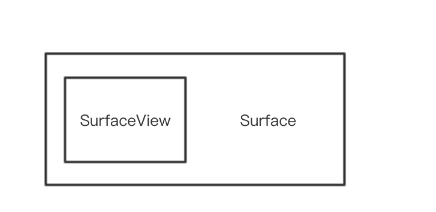

**Surface是通过SurfaceView才能展示其中内容。**

到这里也许大家会有一个疑问，`SurfaceView`和普通的`View`有什么区别？相机开发就一定要用`SurfaceView`吗？

首先普通的`View`和其派生类都是共享同一个`Surface`，所有的绘制必须在主线程(UI线程)进行，通过`Surface`获得对应的`Canvas`，完成绘制`View`的工作。

`SurfaceView`是特殊的`View`，它不与其他普通的`view`共享`Surface`，在自己内部持有`Surface`可以在独立的线程中进行绘制，在自定义相机预览图像这块，更新速度比较快和帧率要求比较高，如果用普通的`View`去更新，极大可能会阻塞UI线程，`SurfaceView`是在一个新起的线程去更新画面并不会阻塞UI线程。还有`SurfaceView`底层实现了双缓冲机制，双缓冲技术主要是为了解决反复局部刷新带来的闪烁问题，对于像游戏，视频这些画面变化特别频繁，如果前面没有显示完，程序又重新绘制，这样会导致屏幕不停得闪烁，而双缓冲及时会把要处理的图片在内存中处理后，把要画的东西先画到一个内存区域里，然后整体一次行画处理，显示在屏幕上。举例说明：
在Android中，如果自定义`View`大多数都会重写`onDraw`方法，`onDraw`方法并不是绘制一点显示一点，而是绘制完成后一次性显示到屏幕上。因为CPU访问内存的速度远远大于访问屏幕的速度，如果需要绘制大量复杂的图形时，每次都一个个从内存读取图形然后绘制到屏幕就会造成多次访问屏幕，这些效率会很低。为了解决这个问题，我们可以创建一个临时的`Canvas`对象，将图像都绘制到这个临时的`Canvas`对象中，绘制完成后通过`drawBitmap`方法绘制到`onDraw`方法中的`Canvas`对象中，这样就相对于`Bitmap`的拷贝过程，比直接绘制效率要高。

所以相机开发中最适合用`SurfaceView`来绘制。
### 3.SurfaceHolder
```java
/**
 * Abstract interface to someone holding a display surface.  Allows you to
 * control the surface size and format, edit the pixels in the surface, and
 * monitor changes to the surface.  This interface is typically available
 * through the {@link SurfaceView} class.
 *
 * <p>When using this interface from a thread other than the one running
 * its {@link SurfaceView}, you will want to carefully read the
 * methods
 * {@link #lockCanvas} and {@link Callback#surfaceCreated Callback.surfaceCreated()}.
 */
 public interface SurfaceHolder {
    ....
     public interface Callback {

        public void surfaceCreated(SurfaceHolder holder);

        public void surfaceChanged(SurfaceHolder holder, int format, int width,
                int height);

        public void surfaceDestroyed(SurfaceHolder holder);
        ...
    }
 }
```
>这是一个抽象的接口给持有`surface`对象使用，允许你控制`surface`的大小和格式，编辑`surface`中的像素和监听`surface`的变化，这个接口通常通过`SurfaceView`这个类来获得。

另外`SurfaceHolder`中有一个`Callback`接口，这个接口有三个方法：
* public void surfaceCreated(SurfaceHolder holder) 
 
  surface第一次创建回调
* public void surfaceChanged(SurfaceHolder,int format,int width,int height) 
  
  surface变化的时候会回调
* public void surfaceDestroyed(SurfaceHolder holder)
  
  surface销毁的时候回调

除了上面`Callback`接口比较重要外，另外还有以下几个方法也比较重要：

* public void addCallback(Callback callback)
  
  为SurfaceHolder添加回调接口
* public void removeCallback(Callback callback)
  
  对SurfaceHolder移除回调接口
* public Canvas lockCanvas()
  
  获取Canvas对象并且对它上锁
* public Canvas lockCanvas(Rect dirty)
  
  获取一个Canvas对象，并且对它上锁，但是所动的内容是dirty所指定的矩形区域
* public void unlockCanvasAndPost(Canvas canvas)
  
  当修改Surface中的数据完成后，释放同步锁，并且提交改变，将新的数据进行展示，同时Surface中的数据会丢失，加锁的目的就是为了在绘制的过程中，Surface数据不会被改变。
* public void setType(int type)
  
  设置Surface的类型，类型有以下几种：
  
  SURFACE_TYPE_NORMAL：用RAM缓存原生数据的普通Surface
  
  SURFACE_TYPE_HARDWARE：适用于DMA(Direct memory access)引擎和硬件加速的Surface

  SURFACE_TYPE_GPU：适用于GPU加速的Surface
  
  SURFACE_TYPE_PUSH_BUFFERS：表明该Surface不包含原生数据，Surface用到的数据由其他对象提供，在Camera图像预览中就使用该类型的Surface，有Camera负责提供给预览Surface数据，这样图像预览会比较流畅，如果设置这种类型就不能调用lockCanvas来获取Canvas对象。
  
  到这里，会发现`Surface`、`SurfaceView`和`SurfaceHolder`就是典型的MVC模型。
  * Surface：原始数据缓冲区，MVC中的M
  * SurfaceView：用来绘制Surface的数据，MVC中的V
  * SurfaceHolder：控制Surface尺寸格式，并且监听Surface的更改，MVC中的C
  
上面三者的关系可以用下面一张图来表示：

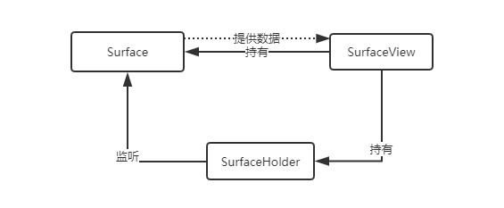
  
## 三、Camera
查看源码时，发现`android.hardware.camera`google不推荐使用了：

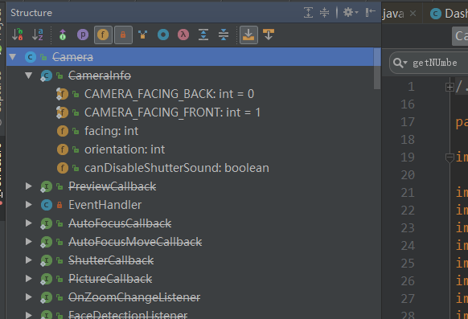

下面讲讲`Camera`最主要的成员和一些接口：

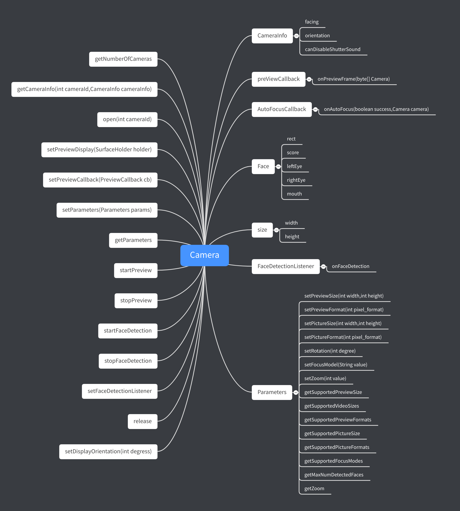

### 1.CameraInfo
在`Camera`类里，`CameraInfo`是静态内部类：
```java
       /**
     * Information about a camera
     * 用来描述相机信息
     * @deprecated We recommend using the new {@link android.hardware.camera2} API for new
     *             applications.
     * 推荐在新的应用使用{android.hardware.camera2}API
     */
    @Deprecated
    public static class CameraInfo {
        /**
         * The facing of the camera is opposite to that of the screen.
         * 相机正面和屏幕正面相反，意思是后置摄像头
         */
        public static final int CAMERA_FACING_BACK = 0;

        /**
         * The facing of the camera is the same as that of the screen.
         * 相机正面和屏幕正面一致，意思是前置摄像头
         */
        public static final int CAMERA_FACING_FRONT = 1;

        /**
         * The direction that the camera faces. It should be
         * CAMERA_FACING_BACK or CAMERA_FACING_FRONT.
         * 摄像机面对的方向，它只能是CAMERA_FACING_BACK或者CAMERA_FACING_FRONT
         *
         */
        public int facing;

        /**
         * <p>The orientation of the camera image. The value is the angle that the
         * camera image needs to be rotated clockwise so it shows correctly on
         * the display in its natural orientation. It should be 0, 90, 180, or 270.</p>
         * orientation是相机收集图片的角度，这个值是相机采集的图片需要顺时针旋转才能正确显示自
         * 然方向的图像,它必须是0，90，180，270中
         *
         *
         * <p>For example, suppose a device has a naturally tall screen. The
         * back-facing camera sensor is mounted in landscape. You are looking at
         * the screen. If the top side of the camera sensor is aligned with the
         * right edge of the screen in natural orientation, the value should be
         * 90. If the top side of a front-facing camera sensor is aligned with
         * the right of the screen, the value should be 270.</p>
         * 举个例子：假设现在竖着拿着手机，后面摄像头传感器是横向(水平方向)的，你现在正在看屏幕
         * 如果摄像机传感器的顶部在自然方向上右边，那么这个值是90度(手机是竖屏，传感器是横屏的)* 
         * 如果前置摄像头的传感器顶部在手机屏幕的右边，那么这个值就是270度，也就是说这个值是相机图像顺时针
         * 旋转到设备自然方向一致时的角度。
         *
         */
        public int orientation;

        /**
         * <p>Whether the shutter sound can be disabled.</p>
         * 是否禁用开门声音
         */
        public boolean canDisableShutterSound;
    };
```

#### 1.1.orientation
可能很多人对上面`orientation`解释有点懵，这里重点讲一下`orientation`，首先先知道四个方向：**屏幕坐标方向**，**自然方向**，**图像传感器方向**，**相机预览方向**。

##### 1.1.1.屏幕坐标方向

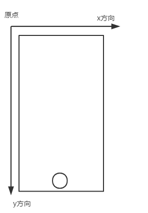

在Android系统中，以屏幕左上角为坐标系统的原点(0,0)坐标，向右延伸是X轴的正方向，向下延伸是y轴的正方向，如上图所示。

##### 1.1.2.自然方向
每个设备都有一个自然方向，手机和平板自然方向不一样，在`Android`应用程序中，`android:screenOrientation`来控制`activity`启动时的方向，默认值`unspecified`即为自然方向，当然可以取值为：
* unspecified，默认值，自然方向
* landscape，强制横屏显示，正常拿设备的时候，宽比高长，这是平板的自然方向
* portrait，正常拿着设备的时候，宽比高短，这是手机的自然方向
* behind：和前一个Activity方向相同
* sensor：根据物理传感器方向转动，用户90度，180度，270度旋转手机方向
* sensorLandScape：横屏选择，一般横屏游戏会这样设置
* sensorPortait:竖屏旋转
* nosensor:旋转设备的时候，界面不会跟着旋转，初始化界面方向由系统控制
* user：用户当前设置的方向

**默认的话：平板的自然方向是横屏，而手机的自然方向是竖屏方向。**

##### 1.1.3.图像传感器方向
手机相机的图像数据都是来自于摄像头硬件的图像传感器，这个传感器在被固定到手机上后有一个默认的取景方向，方向一般是和手机横屏方向一致，如下图：

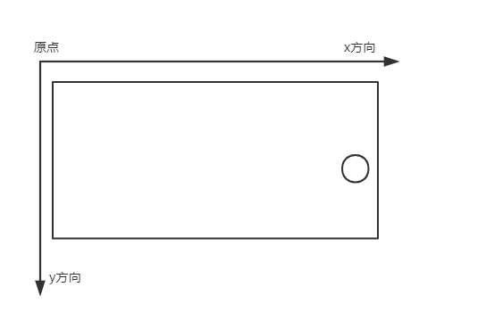

和竖屏应用方向呈90度。

##### 1.1.4.相机预览方向
将图像传感器捕获的图像，显示在屏幕上的方向。在默认情况下，和**图像传感器方向**一致，在相机API中可以通过`setDisplayOrientation(int degrees)`设置预览方向(顺时针设置，不是逆时针)。默认情况下，这个值是0，在注释文档中：
```java
    /**
     * Set the clockwise rotation of preview display in degrees. This affects
     * the preview frames and the picture displayed after snapshot. This method
     * is useful for portrait mode applications. Note that preview display of
     * front-facing cameras is flipped horizontally before the rotation, that
     * is, the image is reflected along the central vertical axis of the camera
     * sensor. So the users can see themselves as looking into a mirror.
     *
     * <p>This does not affect the order of byte array passed in {@link
     * PreviewCallback#onPreviewFrame}, JPEG pictures, or recorded videos. This
     * method is not allowed to be called during preview.
     *
     * 设置预览显示的顺时针旋转角度，会影响预览帧和拍拍照后显示的图片，这个方法对竖屏模式的应用 * 很有用，前置摄像头进行角度旋转之前，图像会进行一个水平的镜像翻转，用户在看预览图像的时候* 就像镜子一样了，这个不影响PreviewCallback的回调，生成JPEG图片和录像文件的方向。
     *
     */
```
###### 1.1.4.1.后置
注意，对于手机来说：
* 横屏下：因为屏幕方向和相机预览方向一致，所以预览图像和看到的实物方向一致
* 竖屏下：屏幕方向和预览方向垂直，会造成旋转90度现象，无论怎么旋转手机，UI预览界面和实物始终是90度，为了得到一致的预览界面需要将相机预览方向旋转90度`(setDisplayOrientation(90))`,这样预览界面和实物方向一致。

下面举个简单例子：


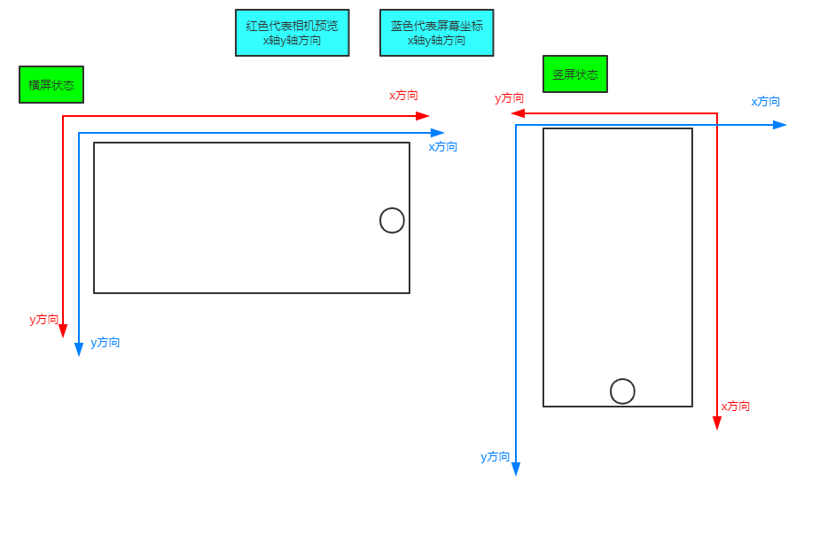

这里重点讲解一下**竖屏**下：


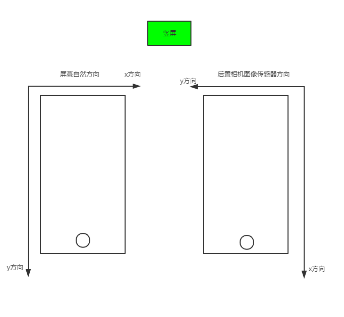


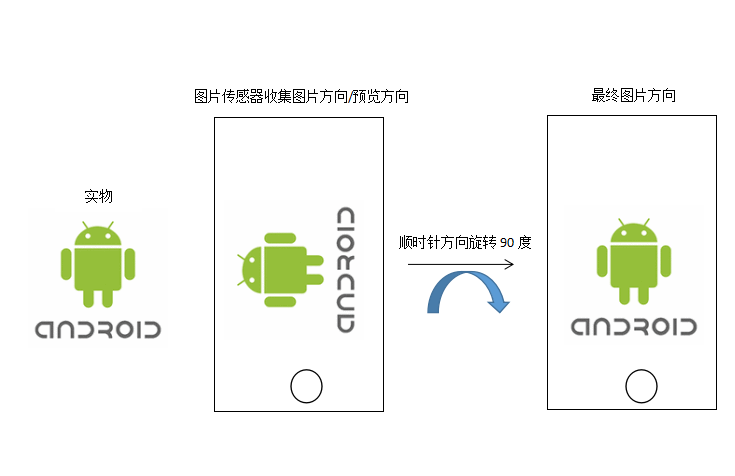

需要结合上下两张图来看：
* 当图像传感器获得图像后，就会知道这幅图像每个坐标的像素值，但是要显示到屏幕上就要**根据屏幕自然方向的坐标来显示(竖屏下屏幕自然方向坐标系和后置相机图像传感器方向呈90度)**，所以图像会逆时针旋转旋转90度，显示到屏幕坐标系上。
* 那么收集的图像时逆时针旋转了90度，那么这时候需要**顺时针旋转90度**才能和收集的自然方向保持一致，也就是和实物图方向一样。

###### 1.1.4.2.前置
在`Android`中，对于前置摄像头，有以下规定：
* 在预览图像是真实物体的镜像
* 拍出的照片和真实场景一样

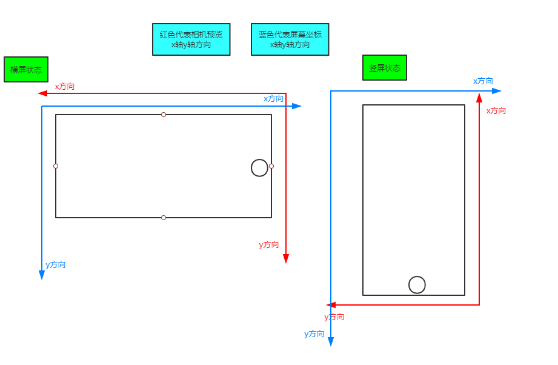

同理这里重点讲一下，**前置竖屏**：

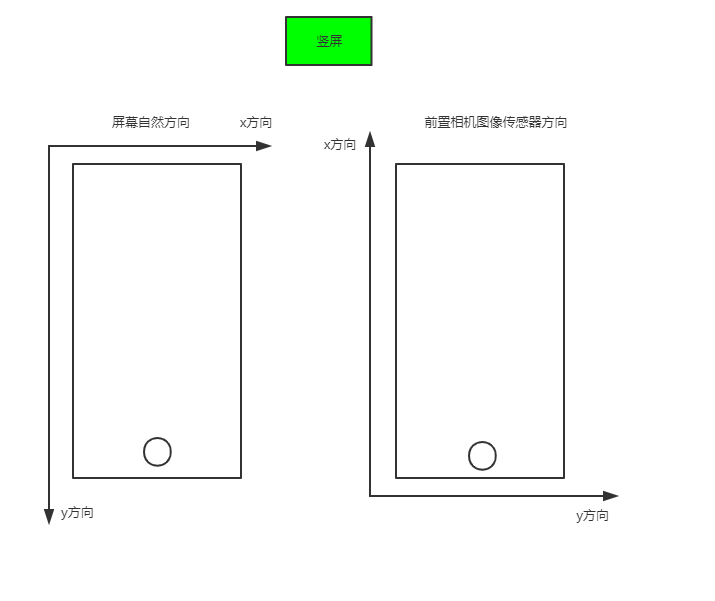

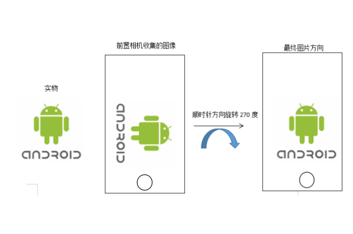

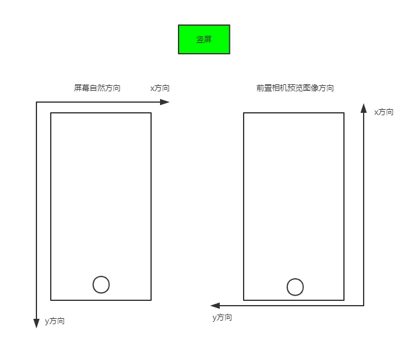

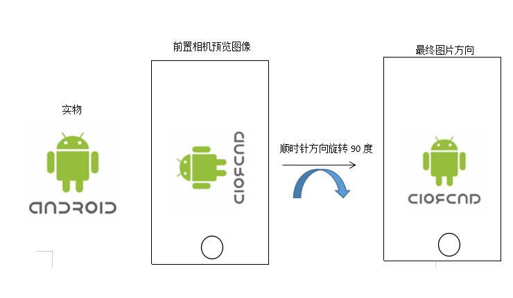

在前置相机中，**预览图像**和**相机收集图像**是镜像关系，上面图中`Android`图标中前置**收集图像**和**预览图像**时相反的，**前置相机图像传感器方向和前置相机预览图像方向是左右相反的**，上图也有体现。

* 前置摄像头收集到图像后(没有经过镜像处理)，但是要显示到屏幕上，就要按照屏幕自然方向的坐标系来进行显示，需要顺时针旋转270度(API没有提供逆时针90度的方法)，才能和手机自然方向一致。
* 在预览的时候，做了镜像处理，所以只需要顺时针旋转90度，就能和自然方向一致，因为摄像图像没有做水平翻转，所以前置摄像头拍出来的图片，你会发现跟预览的时候是左右翻转的，自己可以根据需求做处理。
上面把角度知识梳理了，后面会通过代码一步一步验证，下面按照最开始的思维导图继续看`Camera`内的方法：

#### 1.2.facing
facing代表相机方向，可取值有二：
* CAMREA_FACING_BACK，值为0，表示是后置摄像头
* CAMERA_FACING_FRONT，值为1，表示是前置摄像头

#### 1.3.canDisableShutterSound
是否禁用快门声音

### 2.PreviewCallback
#### 2.1.void onPreviewFrame(byte[] data, Camera camera)
`PreviewCallback`是一个接口，可以给`Camera`设置`Camrea.PreviewCallback`，并且实现这个`onPreviewFrame(byte[] data, Camera camera)`这个方法，就可以去`Camera`预览图片时的数据，如果设置`Camera.setPreviewCallback(callback)`，`onPreviewFrame`这个方法会被一直调用，可以在摄像头对焦成功后设置`camera.setOneShotPreviewCallback(previewCallback)`，这样设置`onPreviewFrame`这个方法就会被调用异常，处理data数据，data是相机预览到的原始数据，可以保存下来当做一张照片。

### 3.AutoFocusCallback
#### 3.1.onAutoFocus(boolean success,Camera camera)
`AutoFocusCallback`是一个接口，用于在相机自动对焦完成后时通知回调，第一个参数是相机是否自动对焦成功，第二个参数是相机对象。

### 4.Face
作为静态内部类，用来描述通过相机人脸检测识别的人脸信息。
#### 4.1.rect
是`Rect`对象，表示检测到人脸的区域，这个`Rect`对象中的坐标并不是安卓屏幕中的坐标，需要进行转换才能使用。
#### 4.2.score
人脸检测的置信度，范围是1到100。100是最高的信度
#### 4.3.leftEye
是一个`Point`对象，表示的是检测到左眼的位置坐标
#### 4.4.rightEye
是一个`Point`对象，表示的是检测到右眼的位置坐标
#### 4.5.mouth
同时一个`Point`对象，表示的是检测到嘴的位置坐标
`leftEye`，`rightEye`，`mouth`有可能获得不到，并不是所有相机支持，不支持情况下，获取为空

### 5.Size
代表拍照图片的大小。
#### 5.1.width
拍照图片的宽
#### 5.2.height
拍照图片的高

### 6.FaceDetectionListener
这是一个接口，当开始预览（人脸识别）的时候开始回调
#### 6.1.onFaceDetection(Face[] faces,Camera camera)
通知监听器预览帧检测到的人脸，`Face[]`是一个数组，用来存放检测的人脸（存放多张人脸），第二个参数是识别人脸的相机。

### 7.Parameters
在`Camera`作为内部类存在，是相机配置设置类，不同设备可能具有不同的照相机功能，如图片大小或者闪光模式。
#### 7.1.setPreviewSize(int width,int height)
设置预览相机图片的大小，`width`是图片的宽，`height`是图片的高
#### 7.2.setPreviewFormat(int pixel_format)
设置预览图片的格式，有以下格式：
* ImageFormat.NV16
* ImageFormat.NV21
* ImageFormat.YUY2
* ImageFormat.YV12
* ImgaeFormat.RGB_565
* ImageFormat.JPEG
如果不设置返回的数据，会默认返回NV21编码数据。

#### 7.3.setPictureSize(int width,int height)
设置保存图片的大小，`width`图片的宽度，以像素为单位，`height`是图片的高度，以像素为单位。

#### 7.4.setPictureFormat(int pixel_format)
设置保存图片的格式，取值和`setPreviewFormat`格式一样。

#### 7.5.setRotation(int degree)
上面已经讲过，设置相机采集照片的角度，这个值是相机所采集的图片需要顺时针选择到自然方向的角度值，它必须是0，90，180或者270中的一个。

#### 7.6.setFocusMode(String value)
设置相机对焦模式，对焦模式有以下：
* AUTO
* INFINITY
* MACRO
* FIXED
* EDOF
* CONTINUOUS_VIDEO

#### 7.7.setZoom(int value)
设置缩放系数，也就是平常所说的变焦。

#### 7.8.getSupportedPreviewSizes()
返回相机支持的预览图片大小，返回值是一个`List<Size>`数组，至少有一个元素。

#### 7.9.getSupportedVideoSizes()
返回获取相机支持的视频帧大小，可以通过MediaRecorder来使用。
#### 7.10.getSupportedPreviewFormats()
返回相机支持的图片预览格式，所有相机都支持ImageFormat.NV21，返回是集合类型并且返回至少包含一个元素。

#### 7.11.getSupportedPictureSize()
以集合的形式返回相机支持采集的图片大小，至少返回一个元素。

#### 7.12.getSupportedPictureFormats()
以集合的形式返回相机支持的图片(拍照后)格式，至少返回一个元素。

#### 7.13.getSupportedFocusModes()
以集合的形式返回相机支持的对焦模式，至少返回一个元素。

#### 7.14.getMaxNumDetectedFaces()
返回相机所支持的最多人脸检测数，如果返回0，则说明制定类型的不支持人脸识别。如果手机摄像头支持最多的人脸检测个数是5个，当画面超出5个人脸数，还是检测到5个人脸数。

#### 7.15.getZoom()
返回当前缩放值，这个值的范围在0到getMaxZoom()之间。

### 8.getNumberOfCameras()
返回当前设备可用的摄像头个数。

### 9.getCameraInfo(int cameraId,CameraInfo cameraInfo)
返回指定id所表示的摄像头信息，如果getNumberOfCameras()返回N，那么有效的id值为0～（N-1），一般手机至少有前后两个摄像头。

### 10.open(int cameraId)
使用传入的id所表示的摄像头来创建Camera对象，如果这个id所表示的摄像头被其他应用程序打开调用此方法会跑出异常，当使用完相机后，必须调用release()来释放资源，否则它会保持锁定状态，不可用其他应用程序。

### 11.setPreviewDisplay(SurfaceHolder holder)
根据所传入的SurfaceHolder对象来设置实时预览。

### 12.setPreviewCallback(PreviewCallback cb)
根据传入的PreviewCallback对象来监听相机预览数据的回调，PreviewCallback再上面已经讲过。

### 13.setParameters(Parameters params)
根据传入的Parameters对象来设置当前相机的参数信息。

### 14.getParameters()
根据传入的Parameters对象来返回当前相机的参数信息

### 15.startPreview()
开始预览，在屏幕上绘制预览帧，如果没有调用setPreviewDisplay(SurfaceHolder)或者setPreviewTexture(SurfaceTexture)直接调用这个方法是没有任何效果的，如果启动预览失败，则会引发RuntimeException。

### 16.stopPreview()
停止预览，停止绘制预览帧到屏幕，如果停止失败，会引发RuntimeException。

### 17.startFaceDetection()
开始人脸识别，这个要调用startPreview之后调用，也就是在预览之后才能进行人脸识别，如果不支持人脸识别，调用此方法会抛出IllegalArgumentException。

### 18.stopFaceDetection()
停止人脸识别。

### 19.setFaceDetectionListener()
给人脸检测设置监听，以便提供预览帧。

### 20.release()
断开并且释放相机对象资源。

### 21.setDisplayOrientation(int degress)
设置相机预览画面旋转的角度，在刚开始讲述orientation的时候讲述角度问题，查看源码时，有以下注释：
```java
public static void setCameraDisplayOrientation(Activity activity,
     int cameraId, android.hardware.Camera camera) {
     android.hardware.Camera.CameraInfo info = new android.hardware.Camera.CameraInfo();
     android.hardware.Camera.getCameraInfo(cameraId, info);
     //获取window(Activity)旋转方向
     int rotation = activity.getWindowManager().getDefaultDisplay().getRotation();
     int degrees = 0;
     switch (rotation) {
         case Surface.ROTATION_0: degrees = 0; break;
         case Surface.ROTATION_90: degrees = 90; break;
         case Surface.ROTATION_180: degrees = 180; break;
         case Surface.ROTATION_270: degrees = 270; break;
     }

     int result;
     //计算图像所要旋转的角度
     if (info.facing == Camera.CameraInfo.CAMERA_FACING_FRONT) {
         result = (info.orientation + degrees) % 360;
         result = (360 - result) % 360;  // compensate the mirror
     } else {  // back-facing
         result = (info.orientation - degrees + 360) % 360;
     }
     //调整图像旋转角度
     camera.setDisplayOrientation(result);
 }
```
上面已经描述过在竖屏下，对于后置相机来讲：

只需要旋转后置相机的orientation也就是90度即可和屏幕方向保持一致；

对于前置相机预览方向，相机预览的图像是相机采集到的图像镜像，所以旋转orientation 270-180=90度才和屏幕方向一致。
CameraInfo是实例化的相机类，info.orientation是相机对于屏幕自然方向(左上角坐标系)的旋转角度数。
那下面跟着官方适配方法走：
* int rotation = activity.getWindowManager().getDefaultDisplay().getRotation();
rotation是预览Window的旋转方向，对于手机而言，当在清单文件设置Activity的screenOrientation="portait"时，rotation=0，这时候没有旋转，当screenOrientation="landScape"时，rotation=1。

* 对于后置摄像头，手机竖屏显示时，预览图像旋转的角度：result=(90-0+360)%360=90；手机横屏显示时，预览图像旋转：result = (90-0+360)%360 = 0;
* camera.setDisplayOrientation(int param)这个方法是图片输出后所旋转的角度数，旋转值可以是0，90，180，270。

**注意：**
**camera.setDisplayOrientation(int param)**这个方法仅仅是修改相机的预览方向，不会影响到**PreviewCallback**回调、生成的JPEG图片和录像视频的方向，这些数据的方向会和图像Sensor方向一致。

## 四、具体实践
### 1.权限处理
需要申请拍照权限和外部存储权限：
```xml
    <!--权限申请 相机-->
    <uses-permission android:name="android.permission.CAMERA"/>
    <!--使用uses-feature指定需要相机资源-->
    <uses-feature android:name="android.hardware.Camera"/>
    <!--需要自动聚焦 -->
    <uses-feature android:name="android.hardware.camera.autofocus"/>
    <!--存储图片或者视频-->
    <uses-permission android:name="android.permission.WRITE_EXTERNAL_STORAGE"/>
```
在`onCreate`检查权限：
```java
    @Override
    protected void onCreate(Bundle savedInstanceState) {
        super.onCreate(savedInstanceState);
        setContentView(R.layout.activity_main);
        initBind();
        initListener();
        checkNeedPermissions();
    }
```
```java
    /**
     * 检测需要申请的权限
     *
     */
    private void checkNeedPermissions(){
        //6.0以上需要动态申请权限 动态权限校验 Android 6.0 的 oppo & vivo 手机时，始终返回 权限已被允许 但是当真正用到该权限时，却又弹出权限申请框。
        if (Build.VERSION.SDK_INT >= 23) {
            if (ContextCompat.checkSelfPermission(this, Manifest.permission.CAMERA)
                    != PackageManager.PERMISSION_GRANTED
                    || ContextCompat.checkSelfPermission(this, Manifest.permission.WRITE_EXTERNAL_STORAGE)
                    != PackageManager.PERMISSION_GRANTED) {
                //多个权限一起申请
                ActivityCompat.requestPermissions(this, new String[]{
                        Manifest.permission.CAMERA,
                        Manifest.permission.WRITE_EXTERNAL_STORAGE
                }, 1);

            } else {
                //已经全部申请 初始化相机资源
                initCamera();
            }

        }else{
            //6.0以下不用动态申请
            initCamera();
        }
    }
```
在`onRequestPermissionsResult`处理回调：
```java
    /**
     * 动态处理申请权限的结果
     * 用户点击同意或者拒绝后触发
     *
     * @param requestCode 请求码
     * @param permissions 权限
     * @param grantResults 结果码
     */
    @Override
    public void onRequestPermissionsResult(int requestCode, String[] permissions, int[] grantResults) {
        super.onRequestPermissionsResult(requestCode, permissions, grantResults);
        switch (requestCode) {
            case 1:
                //获取权限一一验证
                if (grantResults.length > 1) {
                    if (grantResults[0] == PackageManager.PERMISSION_GRANTED) {
                        if (grantResults[1] == PackageManager.PERMISSION_GRANTED) {
                            initCamera();
                        } else {
                            //拒绝就要强行跳转设置界面
                            Permissions.showPermissionsSettingDialog(this, permissions[1]);
                        }
                    } else {
                        //拒绝就要强行跳转设置界面
                        Permissions.showPermissionsSettingDialog(this, permissions[0]);
                    }
                } else {
                    ToastUtil.showShortToast(this, "请重新尝试~");
                }
                break;
        }
    }
```
### 2.调用系统相机
```java
    /**
     * 调用系统相机
     *
     */
    private void goSystemCamera(){
        //在根目录创建jpg文件
        cameraSavePath = new File(Environment.getExternalStorageDirectory().getPath() + "/" + System.currentTimeMillis() +".jpg");
        //指定跳到系统拍照
        Intent intent = new Intent(MediaStore.ACTION_IMAGE_CAPTURE);
        //适配Android 7.0以上版本应用私有目录限制被访问
        if(Build.VERSION.SDK_INT >= Build.VERSION_CODES.N){
           uri = FileProvider.getUriForFile(this, SystemUtil.getPackageName(getApplicationContext()) + ".fileprovider",cameraSavePath);
           intent.addFlags(Intent.FLAG_GRANT_READ_URI_PERMISSION);
        }else{
            //7.0以下
            uri = Uri.fromFile(cameraSavePath);
        }
        //指定ACTION为MediaStore.EXTRA_OUTPUT
        intent.putExtra(MediaStore.EXTRA_OUTPUT,uri);
        //请求码赋值为1
        startActivityForResult(intent,1);
    }
```
在`OnActivityResult(int requestCode,int resultCode,Intent data)`方法做处理：
```java
    @Override
    protected void onActivityResult(int requestCode,int resultCode,Intent data){
        String photoPath;
        //处理拍照后返回的图片路径
        if(requestCode == 1 && resultCode == RESULT_OK){
            if(Build.VERSION.SDK_INT >= Build.VERSION_CODES.N){
               photoPath = String.valueOf(cameraSavePath);
            }else{
               photoPath = uri.getEncodedPath();
            }
            Log.d("拍照返回图片的路径:",photoPath);
            Glide.with(this).load(photoPath).apply(RequestOptions.noTransformation()
            .override(iv_photo.getWidth(),iv_photo.getHeight())
            .error(R.drawable.default_person_icon))
            .into(iv_photo);
        }else if(requestCode == 2 && resultCode == RESULT_OK){
            //处理调用相册返回的路径
            photoPath = PhotoAlbumUtil.getRealPathFromUri(this,data.getData());
            Glide.with(this).load(photoPath).apply(RequestOptions.noTransformation()
                    .override(iv_photo.getWidth(),iv_photo.getHeight())
                    .error(R.drawable.default_person_icon))
                    .into(iv_photo);

        }
        super.onActivityResult(requestCode, resultCode, data);

    }
```
#### 2.1.实际效果


上面是调用系统相机拍照后的效果，另外照片存储到了外部存储的根目录位置：

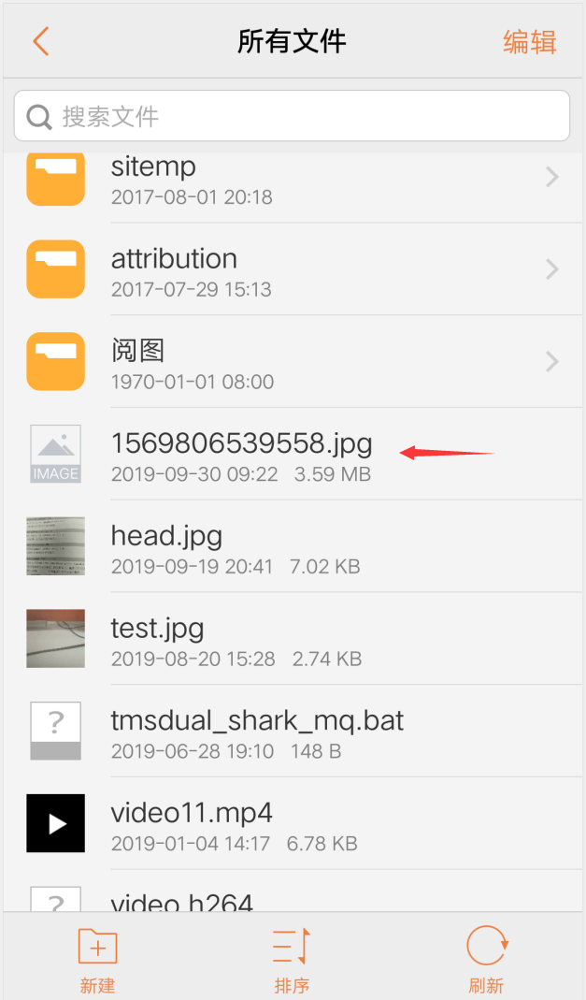

### 3.自定义相机
下面按照以下步骤来实现自定义相机开发：
* 在布局xml文件中定义SurfaceView用于预览，通过SurfaceView.getHolder获取SurfaceHolder对象
* 给SurfaceHolder对象设置监听回调，实现三个方法surfaceCreated(SurfaceHolder holder)、surfaceChanged(SurfaceHolder holder, int format, int width, int height)、surfaceDestroyed(SurfaceHolder holder)
* 在surfaceCreated(SurfaceHolder holder)方法里通过传入的相机id来Camera.open(int cameraId)打开相机
* 给相机设置具体参数，如：预览格式，对焦模式
* 通过Camera.setPreviewDisplay(SurfaceHolder holder)设置实时预览
* 根据官方方法来设置正确的照片预览方向
* 调用Camera.startPreview()开始预览
* 同时可以调用Camera.startFaceDetection来人脸检测，并设置回调，重写onFaceDetection(Camera.Face[] faces, Camera camera)得到检测人脸数量
* 调用Camera.takePicture来进行拍照
* 处理保存的照片，旋转或者压缩
* 当相机不再调用时，释放相机资源

#### 3.1.布局文件
```xml
<?xml version="1.0" encoding="utf-8"?>
<android.support.constraint.ConstraintLayout
    xmlns:android="http://schemas.android.com/apk/res/android"
    xmlns:app="http://schemas.android.com/apk/res-auto"
    android:layout_width="match_parent"
    android:layout_height="match_parent">
    <SurfaceView
        android:id="@+id/sf_camera"
        android:layout_width="match_parent"
        android:layout_height="match_parent"/>
    <android.support.constraint.ConstraintLayout
        android:id="@+id/cl_bottom"
        android:layout_width="match_parent"
        android:layout_height="80dp"
        app:layout_constraintBottom_toBottomOf="parent"
        >
        <!-- 拍照后显示的图片-->
        <ImageView
            android:id="@+id/iv_photo"
            android:layout_width="40dp"
            android:layout_height="40dp"
            android:layout_marginLeft="20dp"
            app:layout_constraintBottom_toBottomOf="parent"
            app:layout_constraintLeft_toLeftOf="parent"
            app:layout_constraintTop_toTopOf="parent"
            />
        <!-- 拍照按钮-->
        <TextView
            android:id="@+id/tv_takephoto"
            android:layout_width="wrap_content"
            android:layout_height="wrap_content"
            android:background="@drawable/icon_take_photo_selector"
            app:layout_constraintBottom_toBottomOf="parent"
            app:layout_constraintHorizontal_bias="0.5"
            app:layout_constraintLeft_toLeftOf="parent"
            app:layout_constraintRight_toRightOf="parent"
            app:layout_constraintTop_toTopOf="parent"/>
    </android.support.constraint.ConstraintLayout>
</android.support.constraint.ConstraintLayout>
```
布局文件主要有拍照预览控件`SurfaceView`、拍照后显示的图片`Imageview`、拍照按钮`Textview`组成。

#### 3.2.初始化SurfaceHolder
新增相机业务逻辑类`CameraPresenter`，目的是将业务和界面显示分开，`Activity`负责UI的显示，业务逻辑在`CameraPresenter`，新增构造函数，构造函数有两个参数，分别是持有手机界面的`Activity`和`SurfaceView`对象，并根据传入的`SurfaceView`对象通过**SurfaceView.getHolder**方法获取`SurfaceHolder`对象：
```java
    public CameraPresenter(AppCompatActivity mAppCompatActivity, SurfaceView mSurfaceView) {
        this.mAppCompatActivity = mAppCompatActivity;
        this.mSurfaceView = mSurfaceView;
        mSurfaceHolder = mSurfaceView.getHolder();
    }
```
SurfaceHolder对象设置监听回调：
```java
    public CameraPresenter(AppCompatActivity mAppCompatActivity, SurfaceView mSurfaceView) {
        this.mAppCompatActivity = mAppCompatActivity;
        this.mSurfaceView = mSurfaceView;
        mSurfaceHolder = mSurfaceView.getHolder();
        init();
    }
    /**
     * 初始化增加回调
     */
    private void init() {
        mSurfaceHolder.addCallback(new SurfaceHolder.Callback() {
            @Override
            public void surfaceCreated(SurfaceHolder holder) {
                //surface创建时执行
            }

            @Override
            public void surfaceChanged(SurfaceHolder holder, int format, int width, int height) {
                //surface绘制时执行
            }

            @Override
            public void surfaceDestroyed(SurfaceHolder holder) {
                //surface销毁时执行
            }
        });
    }
```
#### 3.3.打开相机
在`surfaceCreated(SurfaceHolder holder)`方法里调用打开相机：
```java
    //摄像头Id 默认后置 0,前置的值是1
    private int mCameraId = Camera.CameraInfo.CAMERA_FACING_BACK;
     @Override
     public void surfaceCreated(SurfaceHolder holder) {
         //surface创建时执行
         if (mCamera == null) {
             // mCameraId是后置还是前置 0是后置 1是前置
             openCamera(mCameraId);
            }
        }
     /**
     * 打开相机 并且判断是否支持该摄像头
     *
     * @param FaceOrBack 前置还是后置
     * @return
     */
    private boolean openCamera(int FaceOrBack) {
        //是否支持前后摄像头
        boolean isSupportCamera = isSupport(FaceOrBack);
        //如果支持
        if (isSupportCamera) {
            try {
                mCamera = Camera.open(FaceOrBack);
            } catch (Exception e) {
                e.printStackTrace();
                ToastUtil.showShortToast(mAppCompatActivity, "打开相机失败~");
                return false;
            }

        }

        return isSupportCamera;
    }
```

#### 3.4.设置相机具体参数
调用`Camera.open(int cameraId)`后返回具体的Camera对象后，还需要设置相机一些参数，如预览模式，对焦模式等：
```java
/**
 * 打开相机 并且判断是否支持该摄像头
 *
 * @param FaceOrBack 前置还是后置
 * @return
 */
private boolean openCamera(int FaceOrBack) {
    //是否支持前后摄像头
    boolean isSupportCamera = isSupport(FaceOrBack);
    //如果支持
    if (isSupportCamera) {
        try {
            mCamera = Camera.open(FaceOrBack);
            initParameters(mCamera);
            //设置预览回调
            if (mCamera != null) {
                mCamera.setPreviewCallback(this);
            }
        } catch (Exception e) {
            e.printStackTrace();
            ToastUtil.showShortToast(mAppCompatActivity, "打开相机失败~");
            return false;
        }

    }

    return isSupportCamera;
}


/**
 * 设置相机参数
 *
 * @param camera
 */
private void initParameters(Camera camera) {
    try {
        //获取Parameters对象
        mParameters = camera.getParameters();
        //设置预览格式
        mParameters.setPreviewFormat(ImageFormat.NV21);
        //判断是否支持连续自动对焦图像
        if (isSupportFocus(Camera.Parameters.FOCUS_MODE_CONTINUOUS_PICTURE)) {
            mParameters.setFocusMode(Camera.Parameters.FOCUS_MODE_CONTINUOUS_PICTURE);
        //判断是否支持单次自动对焦    
        } else if (isSupportFocus(Camera.Parameters.FOCUS_MODE_AUTO)) {
            //自动对焦(单次)
            mParameters.setFocusMode(Camera.Parameters.FOCUS_MODE_AUTO);
        }
        //给相机设置参数
        mCamera.setParameters(mParameters);
    } catch (Exception e) {
        e.printStackTrace();
        ToastUtil.showShortToast(mAppCompatActivity, "初始化相机失败");
    }
```

#### 3.5.开始预览
设置完相机参数之后，就可以需要相机调用`Camera.setPreviewDisplay(SurfaceHolder holder)`和`Camera.startPreview()`开启预览：
```java
/**
 * 开始预览
 */
private void startPreview() {
    try {
        //根据所传入的SurfaceHolder对象来设置实时预览
        mCamera.setPreviewDisplay(mSurfaceHolder);
        mCamera.startPreview();
        //这里同时开启人脸检测
        startFaceDetect();
    } catch (IOException e) {
        e.printStackTrace();
    }
}

/**
 * 人脸检测
 */
private void startFaceDetect() {
    //开始人脸识别，这个要调用startPreview之后调用
    mCamera.startFaceDetection();
    //添加回调
    mCamera.setFaceDetectionListener(new Camera.FaceDetectionListener() {
        @Override
        public void onFaceDetection(Camera.Face[] faces, Camera camera) {
            mCameraCallBack.onFaceDetect(transForm(faces), camera);
            Log.d("sssd", "检测到" + faces.length + "人脸");
        }
    });
}
```
在`surfaceCreated(SurfaceHolder holder)`回调方法调用：
```java
...
@Override
public void surfaceCreated(SurfaceHolder holder) {
       //surface创建时执行
       if (mCamera == null) {
            //mCameraId是后置还是前置 0是后置 1是前置
            openCamera(mCameraId);
        }
           //并设置预览
           startPreview();
       }
...
```

#### 3.6.释放相机资源
当相机不再调用的时候，需要调用`Camera.release()`来释放相机资源
```java
/**
 * 释放相机资源
 */
public void releaseCamera() {
    if (mCamera != null) {
        //停止预览
        mCamera.stopPreview();
        mCamera.setPreviewCallback(null);
        //释放相机资源
        mCamera.release();
        mCamera = null;
    }
}
```
在`surfaceDestroyed(SurfaceHolder holder)`调用：
```java
/**
 * 初始化增加回调
 */
private void init() {
    mSurfaceHolder.addCallback(new SurfaceHolder.Callback() {
        @Override
        public void surfaceCreated(SurfaceHolder holder) {
            //surface创建时执行 mCameraId是后置还是前置 0是后置 1是前置
            if (mCamera == null) {
                openCamera(mCameraId);
            }
            //并设置预览
            startPreview();
        }

        @Override
        public void surfaceChanged(SurfaceHolder holder, int format, int width, int height) {
            //surface绘制时执行
        }

        @Override
        public void surfaceDestroyed(SurfaceHolder holder) {
            //surface销毁时执行
            releaseCamera();
        }
    });
}

/**
 * 设置前置还是后置
 *
 * @param mCameraId 前置还是后置
 */
public void setFrontOrBack(int mCameraId) {
    this.mCameraId = mCameraId;

}
```
在自定义相机的`Activity`界面进行调用：
```java
@Override
protected void onCreate(Bundle savedInstanceState) {
    super.onCreate(savedInstanceState);
    setContentView(R.layout.activity_customcamera);
    //绑定View
    initBind();
    //添加点击，触摸事件等监听
    initListener();
    //初始化CameraPresenter
    mCameraPresenter = new CameraPresenter(this,sf_camera);
    //设置后置摄像头
    mCameraPresenter.setFrontOrBack(Camera.CameraInfo.CAMERA_FACING_BACK);
}

```
在`onDestroy()`方法调用`releaseCamera()`:
```java
/**
 * Activity 销毁回调方法 释放各种资源
 */
@Override
protected void onDestroy(){
    super.onDestroy();
    if(mCameraPresenter != null){
        mCameraPresenter.releaseCamera();
    }
}
```
现在先看看效果：


#### 3.7.调整预览图像角度
发现预览效果图逆时针旋转了90度，当你把手机横屏摆放也是，上面已经说过，因为屏幕自然方向和图像传感器方向不一致造成的，需要重新设置预览时的角度，采用官方的推荐方法：
```java
/**
 * 保证预览方向正确
 *
 * @param appCompatActivity Activity
 * @param cameraId          相机Id
 * @param camera            相机
 */
private void setCameraDisplayOrientation(AppCompatActivity appCompatActivity, int cameraId, Camera camera) {
    Camera.CameraInfo info =
            new Camera.CameraInfo();
    Camera.getCameraInfo(cameraId, info);
    //rotation是预览Window的旋转方向，对于手机而言，当在清单文件设置Activity的screenOrientation="portait"时，
    //rotation=0，这时候没有旋转，当screenOrientation="landScape"时，rotation=1。
    int rotation = appCompatActivity.getWindowManager().getDefaultDisplay()
            .getRotation();
    int degrees = 0;
    switch (rotation) {
        case Surface.ROTATION_0:
            degrees = 0;
            break;
        case Surface.ROTATION_90:
            degrees = 90;
            break;
        case Surface.ROTATION_180:
            degrees = 180;
            break;
        case Surface.ROTATION_270:
            degrees = 270;
            break;
    }

    int result;
    //计算图像所要旋转的角度
    if (info.facing == Camera.CameraInfo.CAMERA_FACING_FRONT) {
        result = (info.orientation + degrees) % 360;
        result = (360 - result) % 360;  // compensate the mirror
    } else {  // back-facing
        result = (info.orientation - degrees + 360) % 360;
    }
    orientation = result;
    //调整预览图像旋转角度
    camera.setDisplayOrientation(result);

}
```
并在`startPreview()`方法里调用：
```java
/**
 * 开始预览
 */
private void startPreview() {
    try {
        //根据所传入的SurfaceHolder对象来设置实时预览
        mCamera.setPreviewDisplay(mSurfaceHolder);
        //调整预览角度
        setCameraDisplayOrientation(mAppCompatActivity,mCameraId,mCamera);
        mCamera.startPreview();
        startFaceDetect();
    } catch (IOException e) {
        e.printStackTrace();
    }
}
```
再次看下运行效果：

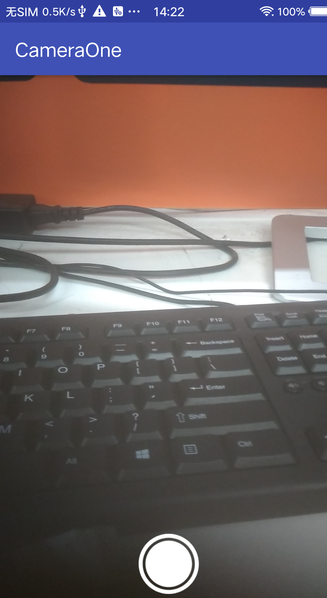

#### 3.8.调整预览和保存图像尺寸
上面调整了预览角度的问题后，因为在市面上安卓机型五花八门，屏幕分辨率也很多，为了避免图像变形，需要调整预览图像和保存的图像尺寸：
```java
//获取屏幕宽和高
private int screenWidth, screenHeight;
public CameraPresenter(AppCompatActivity mAppCompatActivity, SurfaceView mSurfaceView) {
    this.mAppCompatActivity = mAppCompatActivity;
    this.mSurfaceView = mSurfaceView;
    mSurfaceHolder = mSurfaceView.getHolder();
    DisplayMetrics dm = new DisplayMetrics();
    mAppCompatActivity.getWindowManager().getDefaultDisplay().getMetrics(dm);
    //获取宽高像素
    screenWidth = dm.widthPixels;
    screenHeight = dm.heightPixels;
    Log.d("sssd-手机宽高尺寸:",screenWidth +"*"+screenHeight);
    init();
}
/**
 * 
 * 设置保存图片的尺寸
 */
private void setPictureSize() {
    List<Camera.Size> localSizes = mParameters.getSupportedPictureSizes();
    Camera.Size biggestSize = null;
    Camera.Size fitSize = null;// 优先选预览界面的尺寸
    Camera.Size previewSize = mParameters.getPreviewSize();//获取预览界面尺寸
    float previewSizeScale = 0;
    if (previewSize != null) {
        previewSizeScale = previewSize.width / (float) previewSize.height;
    }

    if (localSizes != null) {
        int cameraSizeLength = localSizes.size();
        for (int n = 0; n < cameraSizeLength; n++) {
            Camera.Size size = localSizes.get(n);
            if (biggestSize == null) {
                biggestSize = size;
            } else if (size.width >= biggestSize.width && size.height >= biggestSize.height) {
                biggestSize = size;
            }

            // 选出与预览界面等比的最高分辨率
            if (previewSizeScale > 0
                    && size.width >= previewSize.width && size.height >= previewSize.height) {
                float sizeScale = size.width / (float) size.height;
                if (sizeScale == previewSizeScale) {
                    if (fitSize == null) {
                        fitSize = size;
                    } else if (size.width >= fitSize.width && size.height >= fitSize.height) {
                        fitSize = size;
                    }
                }
            }
        }

        // 如果没有选出fitSize, 那么最大的Size就是FitSize
        if (fitSize == null) {
            fitSize = biggestSize;
        }
        mParameters.setPictureSize(fitSize.width, fitSize.height);
    }

}


/**
 * 设置预览界面尺寸
 */
private void setPreviewSize() {
    //获取系统支持预览大小
    List<Camera.Size> localSizes = mParameters.getSupportedPreviewSizes();
    Camera.Size biggestSize = null;//最大分辨率
    Camera.Size fitSize = null;// 优先选屏幕分辨率
    Camera.Size targetSize = null;// 没有屏幕分辨率就取跟屏幕分辨率相近(大)的size
    Camera.Size targetSiz2 = null;// 没有屏幕分辨率就取跟屏幕分辨率相近(小)的size
    if (localSizes != null) {
        int cameraSizeLength = localSizes.size();
        for (int n = 0; n < cameraSizeLength; n++) {
            Camera.Size size = localSizes.get(n);
            Log.d("sssd-系统支持的尺寸:",size.width + "*" +size.height);
            if (biggestSize == null ||
                    (size.width >= biggestSize.width && size.height >= biggestSize.height)) {
                biggestSize = size;
            }

            //如果支持的比例都等于所获取到的宽高
            if (size.width == screenHeight
                    && size.height == screenWidth) {
                fitSize = size;
                //如果任一宽或者高等于所支持的尺寸
            } else if (size.width == screenHeight
                    || size.height == screenWidth) {
                if (targetSize == null) {
                    targetSize = size;
                //如果上面条件都不成立 如果任一宽高小于所支持的尺寸
                } else if (size.width < screenHeight
                        || size.height < screenWidth) {
                    targetSiz2 = size;
                }
            }
        }

        if (fitSize == null) {
            fitSize = targetSize;
        }

        if (fitSize == null) {
            fitSize = targetSiz2;
        }

        if (fitSize == null) {
            fitSize = biggestSize;
        }
        Log.d("sssd-最佳预览尺寸:",fitSize.width + "*" + fitSize.height);
        mParameters.setPreviewSize(fitSize.width, fitSize.height);
    }
}
```
这里额外要注意：对于相机来说，都是**width**是长边，也就是**width > height**，在上面`setPreviewSize()`方法里，获取所支持的`size.width`要和`screenHeight`比较，`size.height`要和`screenWidth`，最后在设置相机里调用即可：
```java
/**
 * 设置相机参数
 *
 * @param camera
 */
private void initParameters(Camera camera) {
    try {
        //获取Parameters对象
        mParameters = camera.getParameters();
        //设置预览格式
        mParameters.setPreviewFormat(ImageFormat.NV21);
        setPreviewSize();
        setPictureSize();
        //.....
        mCamera.setParameters(mParameters);
    } catch (Exception e) {
        e.printStackTrace();
        ToastUtil.showShortToast(mAppCompatActivity, "初始化相机失败");
    }
}
```
下面看看在vivo x9所支持的尺寸：

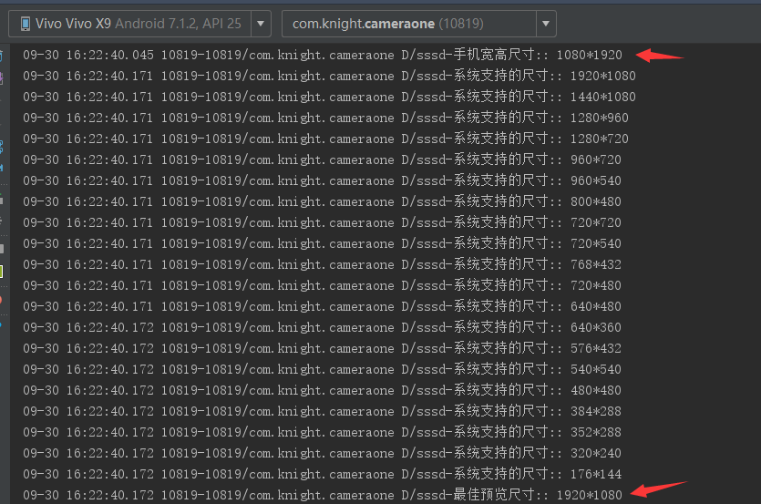
#### 3.9.拍照
下面进行拍照处理，拍照保存图片有两种方式：
* 直接调用`Camera.takePicture(ShutterCallback shutter,PictureCallback raw,PictureCallback jpeg)`
```java
    /**
     * Equivalent to <pre>takePicture(Shutter, raw, null, jpeg)</pre>.
     *
     * @see #takePicture(ShutterCallback, PictureCallback, PictureCallback, PictureCallback)
     */
    public final void takePicture(ShutterCallback shutter, PictureCallback raw,
            PictureCallback jpeg) {
        takePicture(shutter, raw, null, jpeg);
    }
    /**
     * @param shutter   the callback for image capture moment, or null
     * @param raw       the callback for raw (uncompressed) image data, or null
     * @param postview  callback with postview image data, may be null
     * @param jpeg      the callback for JPEG image data, or null
     * @throws RuntimeException if starting picture capture fails; usually this
     *    would be because of a hardware or other low-level error, or because
     *    release() has been called on this Camera instance.
     */
    public final void takePicture(ShutterCallback shutter, PictureCallback raw,
            PictureCallback postview, PictureCallback jpeg) {
            ...
     }
```
三个参数的`takePicture`实际调用四个参数的`takePicture`，只是带有postview图像数据的回调，设置为空了。

* 在相机预览的回调中直接保存：
```java
        mCamera.setPreviewCallback(new Camera.PreviewCallback() {
            @Override
            public void onPreviewFrame(byte[] data, Camera camera) {

            }
        });
```
在`onPreviewFrame`以字节数组形式返回具体照片数据，这个方法会不停的回调，这里不演示这个方法，保存图片的方法和第一个方法是一样的。
首先先自定义回调：
```java
    //自定义回调
    private CameraCallBack mCameraCallBack;
    public interface CameraCallBack {
        //预览帧回调
        void onPreviewFrame(byte[] data, Camera camera);

        //拍照回调
        void onTakePicture(byte[] data, Camera Camera);

        //人脸检测回调
        void onFaceDetect(ArrayList<RectF> rectFArrayList, Camera camera);

        //拍照路径返回
        void getPhotoFile(String imagePath);
    }
```
调用`Camera.takePicture`方法：
```java
/**
 * 拍照
 */
public void takePicture() {
    if (mCamera != null) {
        //拍照回调 点击拍照时回调 写一个空实现
        mCamera.takePicture(new Camera.ShutterCallback() {
            @Override
            public void onShutter() {

            }
        }, new Camera.PictureCallback() {
            //回调没压缩的原始数据
            @Override
            public void onPictureTaken(byte[] data, Camera camera) {

            }
        }, new Camera.PictureCallback() {
            //回调图片数据 点击拍照后相机返回的照片byte数组，照片数据
            @Override
            public void onPictureTaken(byte[] data, Camera camera) {
                //拍照后记得调用预览方法，不然会停在拍照图像的界面
                mCamera.startPreview();
                //回调
                mCameraCallBack.onTakePicture(data, camera);
                //保存图片
                getPhotoPath(data);

            }
        });

    }
}
```
保存图片目录先放在app内：
```java
public class Configuration {
    //这是app内部存储 格式如下 /data/data/包名/xxx/
    public static String insidePath = "/data/data/com.knight.cameraone/pic/";
    //外部路径
    public static String OUTPATH = Environment.getExternalStorageDirectory() + "/拍照-相册/";
}
```
创建目录具体方法：
```java
/**
 * 创建拍照照片文件夹
 */
private void setUpFile() {
    photosFile = new File(Configuration.insidePath);
    if (!photosFile.exists() || !photosFile.isDirectory()) {
        boolean isSuccess = false;
        try {
            isSuccess = photosFile.mkdirs();
        } catch (Exception e) {
            ToastUtil.showShortToast(mAppCompatActivity, "创建存放目录失败,请检查磁盘空间~");
            mAppCompatActivity.finish();
        } finally {
            if (!isSuccess) {
                ToastUtil.showShortToast(mAppCompatActivity, "创建存放目录失败,请检查磁盘空间~");
                mAppCompatActivity.finish();
            }
        }

    }
}
```
在初始化相机时先调用创建文件：
```java
public CameraPresenter(AppCompatActivity mAppCompatActivity, SurfaceView mSurfaceView) {
    //...
    screenWidth = dm.widthPixels;
    screenHeight = dm.heightPixels;
    Log.d("sssd-手机宽高尺寸:",screenWidth +"*"+screenHeight);
    //创建文件夹目录
    setUpFile();
    init();
}
```
拍照后保存图片这种输出耗时操作应该用线程来处理，新建线程池类：
```java
public class ThreadPoolUtil {
    private static ExecutorService threadPool = Executors.newCachedThreadPool();

    /**
     * 在线程池执行一个任务
     * @param runnable 任务
     */
    public static void execute(Runnable runnable){
        threadPool.execute(runnable);
    }

}
```
`getPhotoPath(byte[] data)`方法：
```java
/**
 * @return 返回路径
 */
private void getPhotoPath(final byte[] data) {
    ThreadPoolUtil.execute(new Runnable() {
        @Override
        public void run() {
            long timeMillis = System.currentTimeMillis();
            String time = SystemUtil.formatTime(timeMillis);
            //拍照数量+1
            photoNum++;
            //图片名字
            String name = SystemUtil.formatTime(timeMillis, SystemUtil.formatTime(photoNum) + ".jpg");
            //创建具体文件
            File file = new File(photosFile, name);
            if (!file.exists()) {
                try {
                    file.createNewFile();
                } catch (Exception e) {
                    e.printStackTrace();
                    return;
                }
            }
            try {
                FileOutputStream fos = new FileOutputStream(file);
                try {
                    //将数据写入文件
                    fos.write(data);
                } catch (IOException e) {
                    e.printStackTrace();
                } finally {
                    try {
                        fos.close();
                    } catch (IOException e) {
                        e.printStackTrace();
                    }
                }
                //将图片保存到手机相册中
                SystemUtil.saveAlbum(Configuration.insidePath + file.getName(), file.getName(), mAppCompatActivity);
                //将图片复制到外部
                SystemUtil.coptPicture(Configuration.insidePath + file.getName(),Configuration.OUTPATH,file.getName());
                //发消息给主线程
                Message message = new Message();
                message.what = 1;
                //文件路径
                message.obj = Configuration.insidePath + file.getName();
                mHandler.sendMessage(message);
            } catch (FileNotFoundException e) {
                e.printStackTrace();
            }
        }
    });
}
```
上面代码先把照片存到app包内，再将照片复制到app包外，当图片保存处理完后，回调主线程进行显示图片：
```java
    @SuppressLint("HandlerLeak")
    Handler mHandler = new Handler(){
        @SuppressLint("NewApi")
        @Override
        public void handleMessage(Message msg) {
            switch (msg.what) {
                case 1:
                    mCameraCallBack.getPhotoFile(msg.obj.toString());
                    break;
                default:
                    break;
            }
        }
    };
```
在`Activity`中设置回调：
```java
//添加监听
mCameraPresenter.setCameraCallBack(this);
```
拍照后保存图片后显示在界面上,`Activity`实现照片显示：
```java
/**
 * 返回拍照后的照片
 * @param imagePath
 */
@Override
public void getPhotoFile(String imagePath) {
    //设置头像
    Glide.with(this).load(imagePath)
            .apply(RequestOptions.bitmapTransform(new CircleCrop())
                    .override(iv_photo.getWidth(), iv_photo.getHeight())
                    .error(R.drawable.default_person_icon))
            .into(iv_photo);

}
```
布局文件增加`ImageView`来显示拍照存储后的图片：
```xml
<android.support.constraint.ConstraintLayout
    android:id="@+id/cl_bottom"
    android:layout_width="match_parent"
    android:layout_height="80dp"
    app:layout_constraintBottom_toBottomOf="parent"
    >

    <!-- 拍照后显示的图片-->
    <ImageView
        android:id="@+id/iv_photo"
        android:layout_width="40dp"
        android:layout_height="40dp"
        android:layout_marginLeft="20dp"
        app:layout_constraintBottom_toBottomOf="parent"
        app:layout_constraintLeft_toLeftOf="parent"
        app:layout_constraintTop_toTopOf="parent"
        />
    <!-- 拍照按钮-->
    <TextView
        android:id="@+id/tv_takephoto"
        android:layout_width="wrap_content"
        android:layout_height="wrap_content"
        android:background="@drawable/icon_take_photo_selector"
        app:layout_constraintBottom_toBottomOf="parent"
        app:layout_constraintHorizontal_bias="0.5"
        app:layout_constraintLeft_toLeftOf="parent"
        app:layout_constraintRight_toRightOf="parent"
        app:layout_constraintTop_toTopOf="parent"/>


</android.support.constraint.ConstraintLayout>
```
效果如下：


看看拍照后存储的照片：

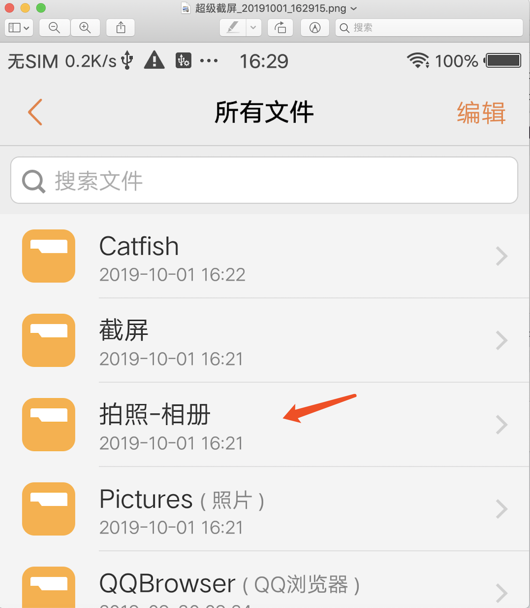


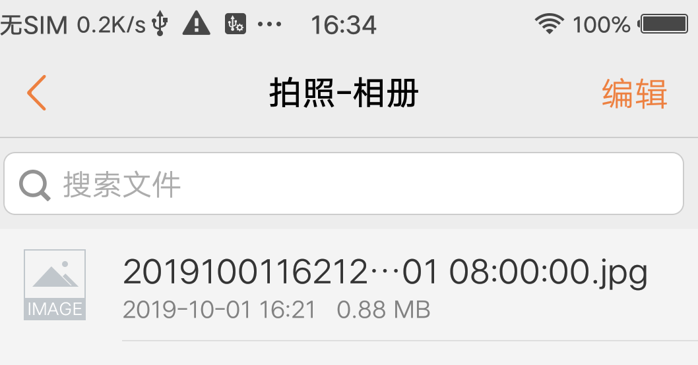


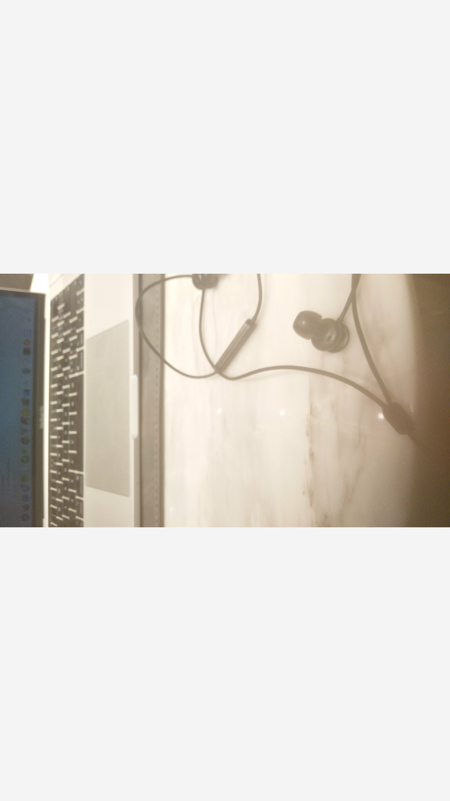

发现拍照后存储的照片经过逆时针90度旋转，需要将顺时针90度，原因在上面分析**orientation**的时候讲述过，虽然调整来预览图像角度，但是并不能调整图片传感器的图片方向，所以只能保存图片后再将图片旋转：
```java
/**
 * 旋转图片
 * @param cameraId 前置还是后置
 * @param orientation 拍照时传感器方向
 * @param path 图片路径
 */
private void rotateImageView(int cameraId,int orientation,String path){
    Bitmap bitmap = BitmapFactory.decodeFile(path);
    Matrix matrix = new Matrix();
    //0是后置
    if(cameraId == 0){
        if(orientation == 90){
            matrix.postRotate(90);
        }
    }
    //1是前置
    if(cameraId == 1){
            //顺时针旋转270度 
            matrix.postRotate(270);
    }
    // 创建新的图片
    Bitmap resizedBitmap = Bitmap.createBitmap(bitmap, 0, 0,
            bitmap.getWidth(), bitmap.getHeight(), matrix, true);
    File file = new File(path);
    //重新写入文件
    try{
        // 写入文件
        FileOutputStream fos;
        fos = new FileOutputStream(file);
        //默认jpg
        resizedBitmap.compress(Bitmap.CompressFormat.JPEG, 100, fos);
        fos.flush();
        fos.close();
        resizedBitmap.recycle();
    }catch (Exception e){
        e.printStackTrace();
        return;
    }

}
```
在保存图像后调用：
```java
/**
 * 
 * 返回图片路径
 * @param data
 */
private void getPhotoPath(final byte[] data) {
    ...
    //将图片旋转
    rotateImageView(mCameraId,orientation,Configuration.insidePath + file.getName());
    //将图片保存到手机相册
    SystemUtil.saveAlbum(Configuration.insidePath + file.getName(), file.getName(), mAppCompatActivity);
    ...
}
```

#### 3.10.变换摄像头
在布局文件添加`TextView`作为前后摄像头转换：
```xml
    <SurfaceView
        android:id="@+id/sf_camera"
        android:layout_width="match_parent"
        android:layout_height="match_parent"/>


    <TextView
        android:id="@+id/tv_change_camera"
        android:layout_width="40dp"
        android:layout_height="40dp"
        android:layout_marginRight="15dp"
        android:layout_marginTop="15dp"
        android:background="@drawable/icon_change_camera_default"
        app:layout_constraintRight_toRightOf="parent"
        app:layout_constraintTop_toTopOf="parent"
        />
```
在`CameraPersenter`中，添加改变摄像头方法：
```java
/**
 * 前后摄像切换
 */
public void switchCamera() {
    //先释放资源
    releaseCamera();
    //在Android P之前 Android设备仍然最多只有前后两个摄像头，在Android p后支持多个摄像头 用户想打开哪个就打开哪个
    mCameraId = (mCameraId + 1) % Camera.getNumberOfCameras();
    //打开摄像头
    openCamera(mCameraId);
    //切换摄像头之后开启预览
    startPreview();
}
```
具体调用：
```java
    case R.id.tv_change_camera:
        mCameraPresenter.switchCamera();
        break;
```
效果如下图：


在看看拍照后存储的照片:

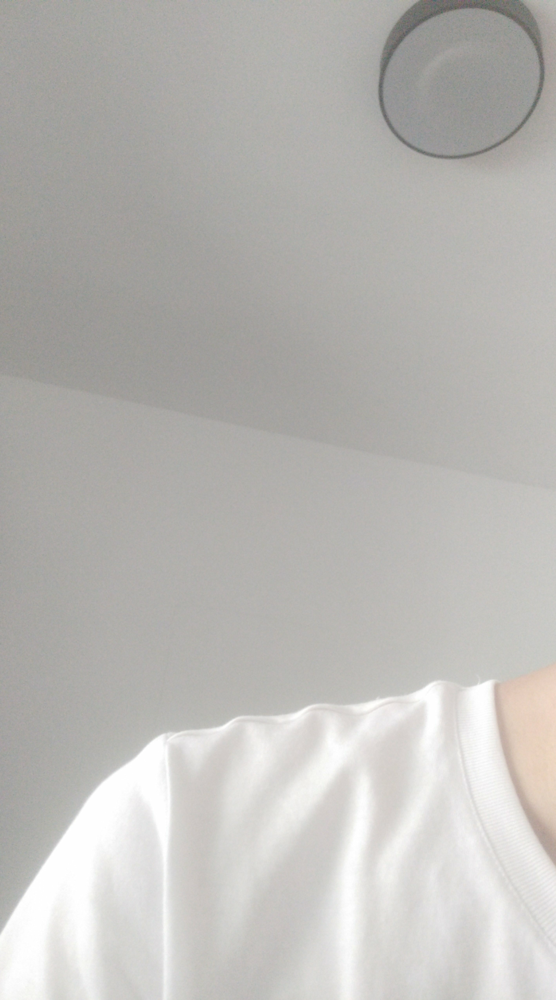
这里可以发现，在预览的时候只是顺时针调用`setDisplayOrientation()`设置预览方向，并没有做镜面翻转，为什么切换前置时，预览效果跟实物一样呢，原来是在调用`setDisplayOrientation()`做了水平镜面的翻转，但是拍照后保存下来的照片是没有水平翻转的，所以同时要对拍照后的照片做水平方向镜面翻转，那就在旋转图片里的方法加上翻转处理：
```java
/**
 * 旋转图片
 * @param cameraId 前置还是后置
 * @param orientation 拍照时传感器方向
 * @param path 图片路径
 */
private void rotateImageView(int cameraId,int orientation,String path){
    Bitmap bitmap = BitmapFactory.decodeFile(path);
    Matrix matrix = new Matrix();
    // 创建新的图片
    Bitmap resizedBitmap;
    //0是后置
    if(cameraId == 0){
        if(orientation == 90){
            matrix.postRotate(90);
        }
    }
    //1是前置
    if(cameraId == 1){
        matrix.postRotate(270);
    }
    // 创建新的图片
    resizedBitmap = Bitmap.createBitmap(bitmap, 0, 0,
            bitmap.getWidth(), bitmap.getHeight(), matrix, true);

    //新增 如果是前置 需要镜面翻转处理
    if(cameraId == 1){
        Matrix matrix1 = new Matrix();
        matrix1.postScale(-1f,1f);
        resizedBitmap = Bitmap.createBitmap(resizedBitmap, 0, 0,
                resizedBitmap.getWidth(), resizedBitmap.getHeight(), matrix1, true);

    }


    File file = new File(path);
    //重新写入文件
    try{
        // 写入文件
        FileOutputStream fos;
        fos = new FileOutputStream(file);
        //默认jpg
        resizedBitmap.compress(Bitmap.CompressFormat.JPEG, 100, fos);
        fos.flush();
        fos.close();
        resizedBitmap.recycle();
    }catch (Exception e){
        e.printStackTrace();
        return;
    }

}
```
这样就能保证预览和拍摄后保存的照片和实物一样了。

#### 3.11.改变焦距
拍照必不可少的一个功能：改变焦距。在`Camera`中的内部类`Camera.Parameters`有`Parameters.setZoom(int value)`来调整预览图像缩放系数，因为在布局`SurfaceView`是全屏的，在`OnTouch`方法做处理，并点击屏幕进行自动变焦处理：
```java
//默认状态
private static final int MODE_INIT = 0;
//两个触摸点触摸屏幕状态
private static final int MODE_ZOOM = 1;
//标识模式
private int mode = MODE_INIT;
...
/**
 *
 * 触摸回调
 * @param v 添加Touch事件具体的view
 * @param event 具体事件
 * @return
 */
@Override
public boolean onTouch(View v, MotionEvent event) {
    //无论多少跟手指加进来，都是MotionEvent.ACTION_DWON MotionEvent.ACTION_POINTER_DOWN
    //MotionEvent.ACTION_MOVE:
    switch (event.getAction() & MotionEvent.ACTION_MASK){
        //手指按下屏幕
        case MotionEvent.ACTION_DOWN:
           mode = MODE_INIT;
           break;
        //当屏幕上已经有触摸点按下的状态的时候，再有新的触摸点被按下时会触发
        case MotionEvent.ACTION_POINTER_DOWN:
           mode = MODE_ZOOM;
           //计算两个手指的距离 两点的距离
           startDis = SystemUtil.twoPointDistance(event);
           break;
        //移动的时候回调
        case MotionEvent.ACTION_MOVE:
            isMove = true;
           //这里主要判断有两个触摸点的时候才触发
           if(mode == MODE_ZOOM){
               //只有两个点同时触屏才执行
               if(event.getPointerCount() < 2){
                 return true;
               }
               //获取结束的距离
               float endDis = SystemUtil.twoPointDistance(event);
               //每变化10f zoom变1
               int scale = (int) ((endDis - startDis) / 10f);
               if(scale >= 1 || scale <= -1){
                   int zoom = mCameraPresenter.getZoom() + scale;
                   //判断zoom是否超出变焦距离
                   if(zoom > mCameraPresenter.getMaxZoom()){
                       zoom = mCameraPresenter.getMaxZoom();
                   }
                   //如果系数小于0
                   if(zoom < 0 ){
                       zoom = 0;
                   }
                   //设置焦距
                   mCameraPresenter.setZoom(zoom);
                   //将最后一次的距离设为当前距离
                   startDis = endDis;
               }
           }
           break;
        case MotionEvent.ACTION_UP:
            //判断是否点击屏幕 如果是自动聚焦
            if(isMove == false){
                //自动聚焦
                mCameraPresenter.autoFoucus();
            }
            isMove = false;
            break;
    }
    return true;
}
```
在`CameraPresenter`内调用：
```java
/**
 * 变焦
 * @param zoom 缩放系数
 */
public void setZoom(int zoom){
   if(mCamera == null){
       return;
   }
   //获取Paramters对象
   Camera.Parameters parameters;
   parameters = mCamera.getParameters();
   //如果不支持变焦
   if(!parameters.isZoomSupported()){
       return;
   }
   //
   parameters.setZoom(zoom);
   //Camera对象重新设置Paramters对象参数
   mCamera.setParameters(parameters);
   mZoom = zoom;

}

/**
 * 自动变焦
 */
public void autoFoucus(){
    if(mCamera == null){
        mCamera.autoFocus(new Camera.AutoFocusCallback() {
            @Override
            public void onAutoFocus(boolean success, Camera camera) {

            }
        });
    }
}
```
最终效果如下图：


#### 3.12.闪光灯设置
通过`Parameters.setFlashMode(String value)`来控制闪光灯，参数类型有以下：
* FLASH_MODE_OFF 关闭闪光灯
* FLASH_MODE_AUTO 在预览，自动对焦和快照过程中需要时，闪光灯会自动开启。
* FLASH_MODE_ON 无论如何均使用闪光灯
* FLASH_MODE_RED_EYE 仿红眼模式，降低红眼模式
* FLASH_MODE_TORCH 系统会判断需要补光而自动决定是否开启闪光灯，手电筒模式，自动对焦

在平时中，用`FLASH_MODE_OFF`和`FLASH_MODE_TORCH`就行
```java
    /**
     *
     * 闪光灯
     * @param turnSwitch true 为开启 false 为关闭
     */
    public void turnLight(boolean turnSwitch){
        if(mCamera == null){
            return;
        }
        Camera.Parameters parameters = mCamera.getParameters();
        if(parameters == null){
            return;
        }

        parameters.setFlashMode(turnSwitch ? Camera.Parameters.FLASH_MODE_TORCH : Camera.Parameters.FLASH_MODE_OFF);
        mCamera.setParameters(parameters);
    }
```
具体调用：
```java
@Override
public void onClick(View v) {
    switch (v.getId()){
        //拍照
        case R.id.iv_photo:
            cy_photo.setVisibility(cy_photo.getVisibility() == View.VISIBLE ? View.GONE : View.VISIBLE);
            break;
        //改变摄像头    
        case R.id.tv_change_camera:
            mCameraPresenter.switchCamera();
            break;
        //关闭还是开启闪光灯    
        case R.id.tv_flash:
            mCameraPresenter.turnLight(isTurn);
            tv_flash.setBackgroundResource(isTurn ? R.drawable.icon_turnon : R.drawable.icon_turnoff);
            isTurn = !isTurn;
        default:
            break;
    }
}
```
实际效果：

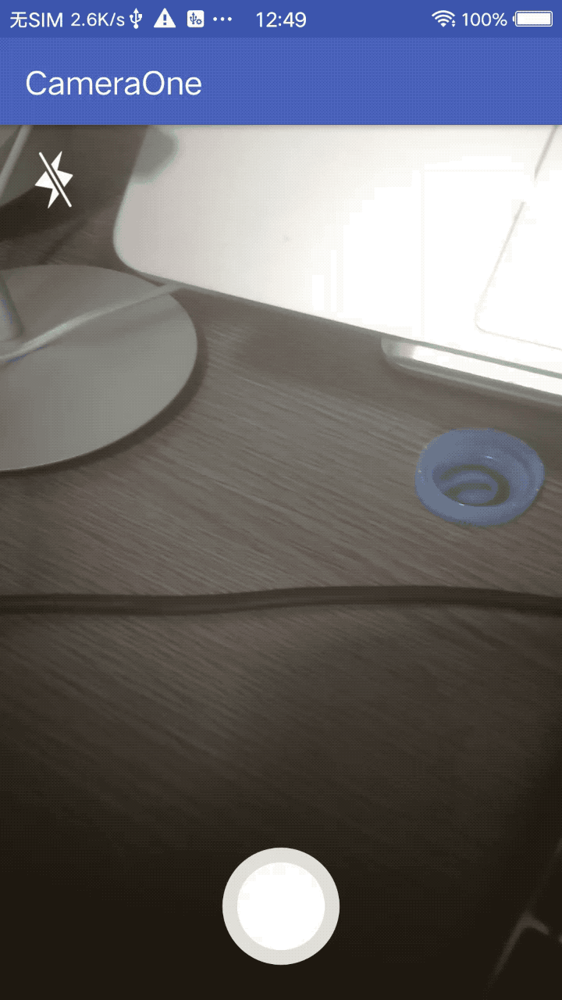
#### 3.13.调整亮度
到这里可以发现，相比于调用系统拍照的清晰度，自定义拍照就逊色一筹，感觉上面有一层蒙版罩着。调用系统拍照可以发现，屏幕亮度故意调亮，那么是不是把自定义拍照的界面亮度调大，效果清晰度会不会好一些呢，下面试试，在`CustomCameraActivity`加入：
```java
/**
 *
 * 加入调整亮度
 */
private void getScreenBrightness(){
    WindowManager.LayoutParams lp = getWindow().getAttributes();
    //screenBrightness的值是0.0-1.0 从0到1.0 亮度逐渐增大 如果是-1，那就是跟随系统亮度 这里调成 0.78左右
    lp.screenBrightness = Float.valueOf(200) * (1f / 255f);
    getWindow().setAttributes(lp);
}
```
在`onCreate`调用即可，最后效果如下：

自定义相机效果如下：
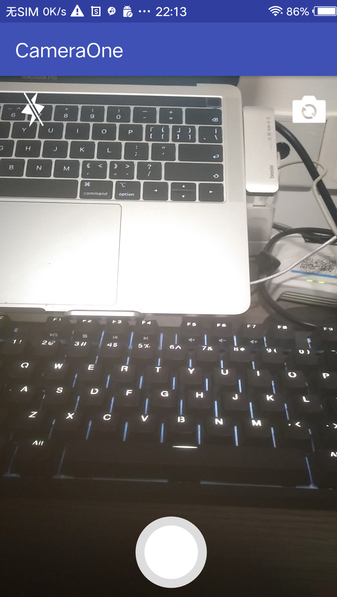
调用系统相机效果如下：

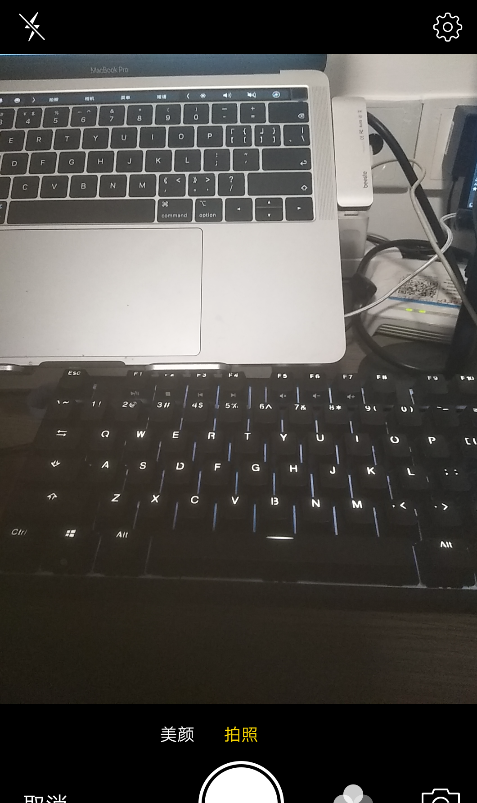
效果确实比之前好多了。

#### 3.14.视频录制
下面简单实现录制视频的功能，利用`MediaRecorder`来实现直接录制视频，这里要注意：MediaRecorder是不能对每一帧数据做处理的，录制视频需要用到以下工具：
* MediaRecorder：视频编码的封装
* camera：视频画面原属数据采集
* SurfaceView：提供预览画面

##### 3.14.1.MediaRecorder基本介绍
>MediaRecorder是Android中面向应用层的封装，用于提供音视频编码的封装操作的工具，下面直接上官方图：

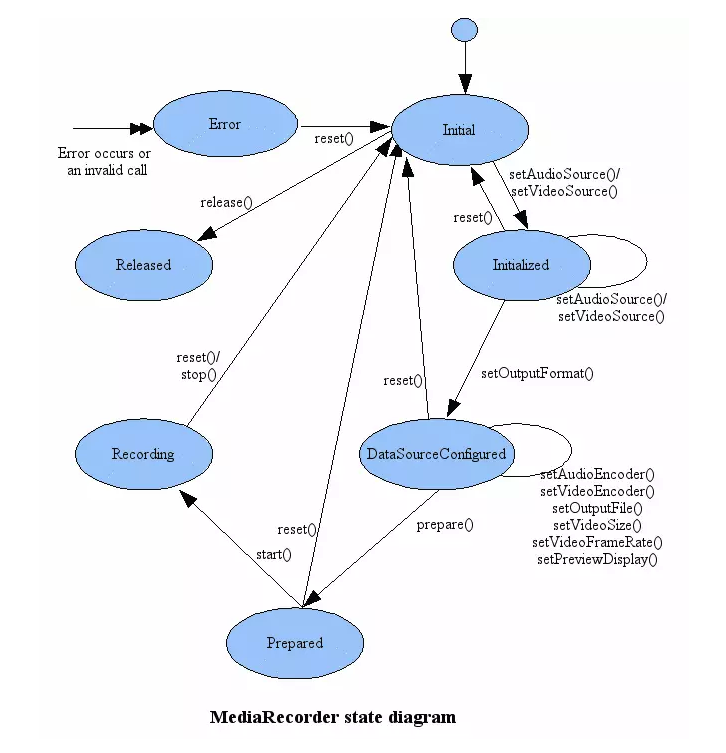

下面简单介绍这几个生命周期的状态意思：
* `Initial`:在`MediaRecorder`对象被创建时或者调用`reset()`方法后，会处于该状态。
* `Initialized`:当调用`setAudioSource()`或者`setVideoSource()`后就会处于该状态，这两个方法主要用于设置音视频的播放源配置，在该状态下可以调用`reset()`回到`Initial`状态。
* `DataSourceConfigured`:当调用`setOutputFormat`方法后，就会处于该状态，这个方法用来设置文件格式，如设置为`mp4`或者`mp3`，在这个状态同时可以设置音视频的封装格式，采样率，视频码率，帧率等，可以通过调用`reset()`回到`Initial`状态。
* `Prepared`:当调用上面几个方法后，就可以调用`prepare()`进入这个状态，只有处于这个状态才能调用`start()`方法。
* `Recording`:通过调用`start()`来进入该状态，处于这个状态就是真正录制音视频，通过调用`reset()`或者`stop()`来回到`Initial`状态。
* `error`:当录制过程中发生错误，就会进入该状态，调用`reset()`回到`Initial`状态。
* `release`:释放系统资源，只有在`Initial`状态才能调用`release()`回到该状态。

##### 3.14.2.调整输出视频尺寸的宽高
**注意**：要添加录音权限，这里不在讲述。
```java
/**
 * 获取输出视频的width和height
 *
 */
public void getVideoSize(){
    int biggest_width=0 ,biggest_height=0;//最大分辨率
    int fitSize_width=0,fitSize_height=0;
    int fitSize_widthBig=0,fitSize_heightBig=0;
    Camera.Parameters parameters = mCamera.getParameters();
    //得到系统支持视频格式
    List<Camera.Size> videoSize = parameters.getSupportedVideoSizes();
    for(int i = 0;i < videoSize.size();i++){
        int w = videoSize.get(i).width;
        int h = videoSize.get(i).height;
        if ((biggest_width == 0 && biggest_height == 0)||
                (w >= biggest_height && h >= biggest_width)) {
            biggest_width = w;
            biggest_height = h;
        }

        if(w == screenHeight && h == screenWidth){
            width = w;
            height = h;
        }else if(w == screenHeight || h == screenWidth){
            if(width == 0 || height == 0){
                fitSize_width = w;
                fitSize_height = h;

            }else if(w < screenHeight || h < screenWidth){
                fitSize_widthBig = w;
                fitSize_heightBig = h;

            }
        }
    }

    if(width == 0 && height == 0){
        width = fitSize_width;
        height = fitSize_height;
    }

    if(width == 0 && height == 0){
        width = fitSize_widthBig;
        height = fitSize_heightBig;
    }

    if(width == 0 && height == 0){
        width = biggest_width;
        height = biggest_height;

    }
}
```
在初始化相机方法调用，并且创建`MediaRecorder`对象:
```java
        @Override
        public void surfaceCreated(SurfaceHolder holder) {
            //surface创建时执行
            if (mCamera == null) {
                openCamera(mCameraId);
            }
            //并设置预览
            startPreview();
            //新增获取系统支持视频
            getVideoSize();
            mediaRecorder = new MediaRecorder();
        }
```

##### 3.14.3.设置MediaRecorder参数
```java
    //解锁Camera硬件
    mCamera.unlock();
    mediaRecorder.setCamera(mCamera);
    //音频源 麦克风
    mediaRecorder.setAudioSource(MediaRecorder.AudioSource.CAMCORDER);
    //视频源 camera
    mediaRecorder.setVideoSource(MediaRecorder.VideoSource.CAMERA);
    //输出格式
    mediaRecorder.setOutputFormat(MediaRecorder.OutputFormat.MPEG_4);
    //音频编码
    mediaRecorder.setAudioEncoder(MediaRecorder.VideoEncoder.DEFAULT);
    //视频编码
    mediaRecorder.setVideoEncoder(MediaRecorder.VideoEncoder.H264);
    //设置帧频率
    mediaRecorder.setVideoEncodingBitRate(1 * 1024 * 1024 * 100);
    Log.d("sssd视频宽高：","宽"+width+"高"+height+"");
    mediaRecorder.setVideoSize(width,height);
    //每秒的帧数
    mediaRecorder.setVideoFrameRate(24);
```

##### 3.14.4.调整保存视频角度
如果不设置调整保存视频的角度，用后置录制视频会逆时针翻转90度，所以需要设置输出顺时针旋转90度：
```java
    //调整视频旋转角度 如果不设置 后置和前置都会被旋转播放
    if(mCameraId == Camera.CameraInfo.CAMERA_FACING_FRONT) {
        if(orientation == 270 || orientation == 90 || orientation == 180){
            mediaRecorder.setOrientationHint(180);
        }else{
            mediaRecorder.setOrientationHint(0);
        }
    }else{
        if(orientation == 90){
            mediaRecorder.setOrientationHint(90);
        }
    }
```
整个录制方法如下：
```java
/**
 *
 * 录制方法
 */
public void startRecord(String path,String name){
    //解锁Camera硬件
    mCamera.unlock();
    mediaRecorder.setCamera(mCamera);
    //音频源 麦克风
    mediaRecorder.setAudioSource(MediaRecorder.AudioSource.CAMCORDER);
    //视频源 camera
    mediaRecorder.setVideoSource(MediaRecorder.VideoSource.CAMERA);
    //输出格式
    mediaRecorder.setOutputFormat(MediaRecorder.OutputFormat.MPEG_4);
    //音频编码
    mediaRecorder.setAudioEncoder(MediaRecorder.VideoEncoder.DEFAULT);
    //视频编码
    mediaRecorder.setVideoEncoder(MediaRecorder.VideoEncoder.H264);
    //设置帧频率
    mediaRecorder.setVideoEncodingBitRate(1 * 1024 * 1024 * 100);
    Log.d("sssd视频宽高：","宽"+width+"高"+height+"");
    mediaRecorder.setVideoSize(width,height);
    //每秒的帧数
    mediaRecorder.setVideoFrameRate(24);
    //调整视频旋转角度 如果不设置 后置和前置都会被旋转播放
    if(mCameraId == Camera.CameraInfo.CAMERA_FACING_FRONT) {
        if(orientation == 270 || orientation == 90 || orientation == 180){
            mediaRecorder.setOrientationHint(180);
        }else{
            mediaRecorder.setOrientationHint(0);
        }
    }else{
        if(orientation == 90){
            mediaRecorder.setOrientationHint(90);
        }
    }

    File file = new File(path);
    if(!file.exists()){
        file.mkdirs();
    }
    //设置输出文件名字
    mediaRecorder.setOutputFile(path + File.separator + name + "mp4");
    File file1 = new File(path + File.separator + name + "mp4");
    if(file1.exists()){
        file1.delete();
    }
    //设置预览
    mediaRecorder.setPreviewDisplay(mSurfaceView.getHolder().getSurface());
    try {
        //准备录制
        mediaRecorder.prepare();
        //开始录制
        mediaRecorder.start();
    } catch (IOException e) {
        e.printStackTrace();
    }
}
```

##### 3.14.5.停止录制
当停止录制后需要把`MediaRecorder`释放，并且重新调用预览方法：
```java
/**
 *
 * 停止录制
 */
public void stopRecord(){
    if(mediaRecorder != null){
        mediaRecorder.release();
        mediaRecorder = null;
    }

    if(mCamera != null){
        mCamera.release();
    }
    openCamera(mCameraId);
    //并设置预览
    startPreview();
}
```

##### 3.14.6.具体调用
```java
mCameraPresenter.startRecord(Configuration.OUTPATH,"video");
```

##### 3.14.7.视频播放
当录制完需要播放，用新的界面来，用`SurfaceView`+`MediaPlayer`来实现：
```java
public class PlayAudioActivity extends AppCompatActivity implements MediaPlayer.OnCompletionListener,MediaPlayer.OnPreparedListener{
    private SurfaceView sf_play;
    private MediaPlayer player;
    @Override
    protected void onCreate(Bundle savedInstanceState) {
        super.onCreate(savedInstanceState);
        setContentView(R.layout.activity_playaudio);
        sf_play = findViewById(R.id.sf_play);
        //下面开始实例化MediaPlayer对象
        player = new MediaPlayer();
        player.setOnCompletionListener(this);
        player.setOnPreparedListener(this);
        //设置数据数据源，也就播放文件地址，可以是网络地址
        String dataPath = Configuration.OUTPATH + "/videomp4";
        try {
            player.setDataSource(dataPath);
        } catch (Exception e) {
            e.printStackTrace();
        }

        sf_play.getHolder().addCallback(new SurfaceHolder.Callback() {
            @Override
            public void surfaceCreated(SurfaceHolder holder) {
                //将播放器和SurfaceView关联起来
                player.setDisplay(holder);
                //异步缓冲当前视频文件，也有一个同步接口
                player.prepareAsync();
            }

            @Override
            public void surfaceChanged(SurfaceHolder holder, int format, int width, int height) {

            }
            @Override
            public void surfaceDestroyed(SurfaceHolder holder) {

            }
        });


    }
    /**
     *
     * 设置循环播放
     * @param mp
     */
    @Override
    public void onCompletion(MediaPlayer mp) {
        player.start();
        player.setLooping(true);
    }

    /**
     * 这边播放
     * @param mp
     */
    @Override
    public void onPrepared(MediaPlayer mp) {
        player.start();
    }

    /**
     * 释放资源
     *
     */
    @Override
    protected void onDestroy(){
        super.onDestroy();
        if(player != null){
            player.reset();
            player.release();
            player = null;

        }
    }
}
```
实际效果：


视频存放路径信息：

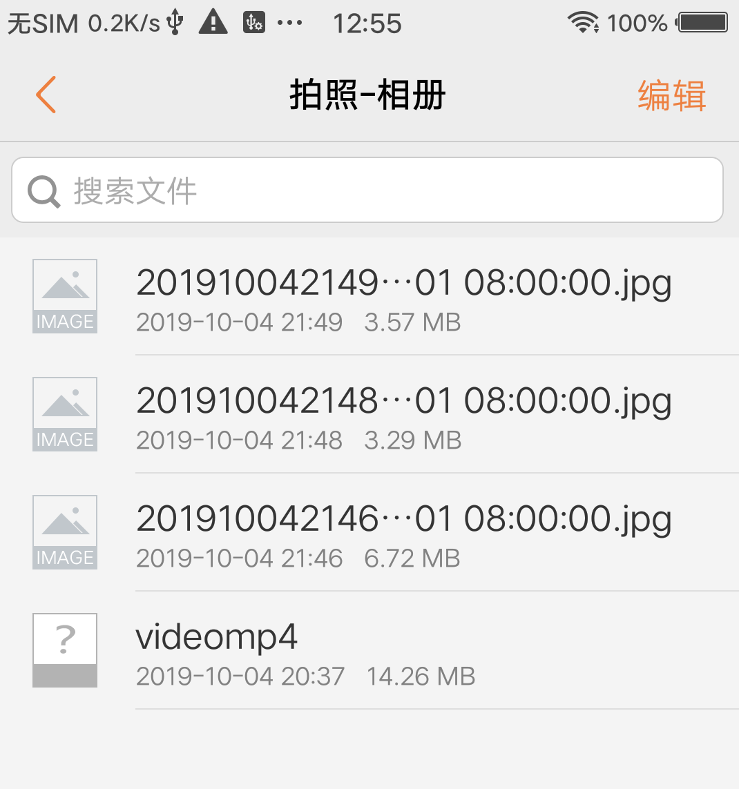

#### 3.15.人脸检测
下面实现人脸检测，注意是人脸检测不是人脸识别，步骤如下：
* 在相机预览后，调用startFaceDetection方法开启人脸检测
* 调用setFaceDetectionListener(FaceDetectionListener listener)设置人脸检测回调
* 自定义View，用来绘制人脸大致区域
* 在人脸回调中，所获取的人脸信息传递给自定义View，自定义View根据人脸信息绘制大致区域

##### 3.15.1.开启人脸检测
在相机调用开启预览后才能调用：
```java
/**
 * 开始预览
 */
private void startPreview() {
    try {
        //根据所传入的SurfaceHolder对象来设置实时预览
        mCamera.setPreviewDisplay(mSurfaceHolder);
        //调整预览角度
        setCameraDisplayOrientation(mAppCompatActivity,mCameraId,mCamera);
        mCamera.startPreview();
        //开启人脸检测
        startFaceDetect();
    } catch (IOException e) {
        e.printStackTrace();
    }
}
```
##### 3.15.2.设置人脸检测回调
```java
/**
 * 人脸检测
 */
private void startFaceDetect() {
    //开始人脸检测，这个要调用startPreview之后调用
    mCamera.startFaceDetection();
    //添加回调
    mCamera.setFaceDetectionListener(new Camera.FaceDetectionListener() {
        @Override
        public void onFaceDetection(Camera.Face[] faces, Camera camera) {
      //      mCameraCallBack.onFaceDetect(transForm(faces), camera);
            mFaceView.setFace(transForm(faces));
            Log.d("sssd", "检测到" + faces.length + "人脸");
            for(int i = 0;i < faces.length;i++){
                Log.d("第"+(i+1)+"张人脸","分数"+faces[i].score+"左眼"+faces[i].leftEye+"右眼"+faces[i].rightEye+"嘴巴"+faces[i].mouth);
            }
        }
    });
}
```
在`Face`源码中，可以看到这么一段描述：
>
          Bounds of the face. (-1000, -1000) represents the top-left of the
          camera field of view, and (1000, 1000) represents the bottom-right of
          the field of view. For example, suppose the size of the viewfinder UI
          is 800x480. The rect passed from the driver is (-1000, -1000, 0, 0).
          The corresponding viewfinder rect should be (0, 0, 400, 240). It is
          guaranteed left < right and top < bottom. The coordinates can be
          smaller than -1000 or bigger than 1000. But at least one vertex will
          be within (-1000, -1000) and (1000, 1000).

          <p>The direction is relative to the sensor orientation, that is, what
          the sensor sees. The direction is not affected by the rotation or
          mirroring of {@link #setDisplayOrientation(int)}. The face bounding
          rectangle does not provide any information about face orientation.</p>

          <p>Here is the matrix to convert driver coordinates to View coordinates
          in pixels.</p>
          <pre>
          Matrix matrix = new Matrix();
          CameraInfo info = CameraHolder.instance().getCameraInfo()[cameraId];
          // Need mirror for front camera.
          boolean mirror = (info.facing == CameraInfo.CAMERA_FACING_FRONT);
          matrix.setScale(mirror ? -1 : 1, 1);
          // This is the value for android.hardware.Camera.setDisplayOrientation.
          matrix.postRotate(displayOrientation);
          // Camera driver coordinates range from (-1000, -1000) to (1000, 1000).
          // UI coordinates range from (0, 0) to (width, height).
          matrix.postScale(view.getWidth() / 2000f, view.getHeight() / 2000f);
          matrix.postTranslate(view.getWidth() / 2f, view.getHeight() / 2f);
          </pre>

          @see #startFaceDetection()


具体意思是在人脸使用的坐标和安卓屏幕坐标是不一样的，并且举了一个例子：如果屏幕尺寸是800*480，现在有一个矩形位置在人脸坐标系中位置是(-1000,-1000,0,0)，那么在安卓屏幕坐标的位置是(0,0,400,240)。

并且给了转换坐标的具体方法：
```java
/**
 * 将相机中用于表示人脸矩形的坐标转换成UI页面的坐标
 *
 * @param faces 人脸数组
 * @return
 */
private ArrayList<RectF> transForm(Camera.Face[] faces) {
    Matrix matrix = new Matrix();
    boolean mirror;
    if (mCameraId == Camera.CameraInfo.CAMERA_FACING_FRONT) {
        mirror = true;
    } else {
        mirror = false;
    }
    //前置需要镜像
    if (mirror) {
        matrix.setScale(-1f, 1f);
    } else {
        matrix.setScale(1f, 1f);
    }
    //后乘旋转角度
    matrix.postRotate(Float.valueOf(orientation));
    //后乘缩放
    matrix.postScale(mSurfaceView.getWidth() / 2000f,mSurfaceView.getHeight() / 2000f);
    //再进行位移
    matrix.postTranslate(mSurfaceView.getWidth() / 2f, mSurfaceView.getHeight() / 2f);
    ArrayList<RectF> arrayList = new ArrayList<>();
    for (Camera.Face rectF : faces) {
        RectF srcRect = new RectF(rectF.rect);
        RectF dstRect = new RectF(0f, 0f, 0f, 0f);
        //通过Matrix映射 将srcRect放入dstRect中
        matrix.mapRect(dstRect, srcRect);
        arrayList.add(dstRect);
    }
    return arrayList;

}
```

##### 3.15.3.实现自定义View
```java
package com.knight.cameraone.view;

import android.content.Context;
import android.graphics.Canvas;
import android.graphics.Color;
import android.graphics.Paint;
import android.graphics.RectF;
import android.support.annotation.Nullable;
import android.util.AttributeSet;
import android.util.TypedValue;
import android.view.View;

import java.util.ArrayList;

/**
 * @author created by knight
 * @organize
 * @Date 2019/10/11 13:54
 * @descript:人脸框
 */

public class FaceDeteView extends View {

    private Paint mPaint;
    private String mColor = "#42ed45";
    private ArrayList<RectF> mFaces = null;
    public FaceDeteView(Context context) {
        super(context);
        init(context);
    }

    public FaceDeteView(Context context, @Nullable AttributeSet attrs) {
        super(context, attrs);
        init(context);
    }

    public FaceDeteView(Context context, @Nullable AttributeSet attrs, int defStyleAttr) {
        super(context, attrs, defStyleAttr);
        init(context);
    }


    private void init(Context context){
        mPaint = new Paint();
        //画笔颜色
        mPaint.setColor(Color.parseColor(mColor));
        //只绘制图形轮廓
        mPaint.setStyle(Paint.Style.STROKE);
        //设置粗细
        mPaint.setStrokeWidth(TypedValue.applyDimension(TypedValue.COMPLEX_UNIT_DIP,1f,context.getResources().getDisplayMetrics()));
        //设置抗锯齿
        mPaint.setAntiAlias(true);
    }


    @Override
    protected void onDraw(Canvas canvas){
        super.onDraw(canvas);
        if(mFaces != null){
            for(RectF face:mFaces){
                canvas.drawRect(face,mPaint);
            }

        }
    }


    /**
     * 设置人人脸信息
     */
    public void setFace(ArrayList<RectF> mFaces){
       this.mFaces = mFaces;
       //重绘矩形框
       invalidate();
    }

}

```
布局文件：
```xml
    <SurfaceView
        android:id="@+id/sf_camera"
        android:layout_width="match_parent"
        android:layout_height="match_parent"/>
    <!-- 新增 -->
    <com.knight.cameraone.view.FaceDeteView
        android:id="@+id/faceView"
        android:layout_width="match_parent"
        android:layout_height="match_parent"/>
```
并增加人脸检测开关：
```java
    /**
     * 开启人脸检测
     *
     */
    public void turnFaceDetect(boolean isDetect){
         mFaceView.setVisibility(isDetect ?  View.VISIBLE : View.GONE);
    }
```
这里只是将自定义View不显示，具体效果图如下：

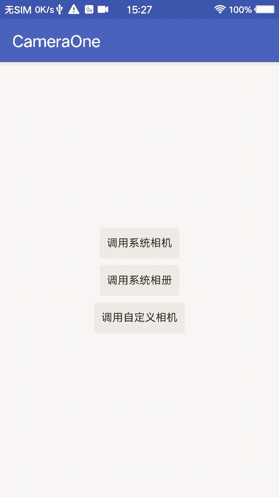
查看具体打印数据：

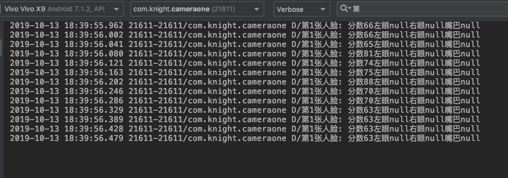
可以发现在`vivo`安卓7.1.1版本下，眼睛，嘴巴数据是获取不到的。

## 五、参考资料
* [Android: Camera相机开发详解(上) —— 知识储备](https://www.jianshu.com/p/f8d0d1467584)
* [Android Camera基本用法一](https://blog.csdn.net/u010126792/article/details/86529646)


    


    


  
  
  


